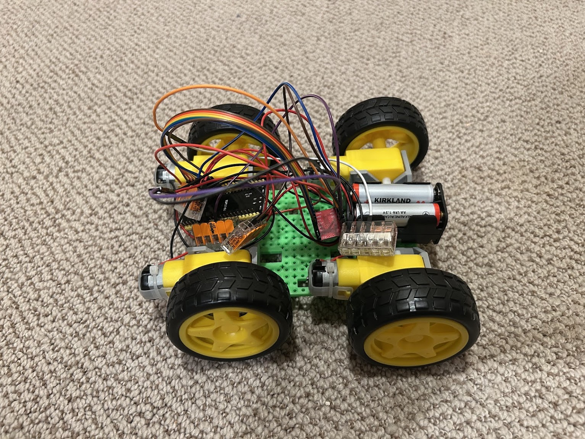

# Mars Base Rover


A small ESP32-powered Mars Base rover project built with my children. The project pairs a compact joystick controller with a differential-drive rover using ESP-NOW, a low-latency wireless protocol that works without a Wi-Fi network.





## What it does


- Reads a two-axis joystick on an ESP32-C3 controller.
- Converts joystick input into left- and right-motor commands for intuitive steering.
- Sends commands wirelessly to the rover with ESP-NOW.
- Limits active transmissions while moving and sends a low-frequency heartbeat while idle.
- Stops the motors automatically if the rover loses contact with the controller for one second.


## Hardware


- ESP32-C3 controller
- ESP32-based rover receiver
- Analog joystick
- TB6612 motor driver
- Two DC motors


## Project layout


```text
controller/
  Mini_Controller_v1.1_Efficient_ESP_NOW.ino
rover/
  Rover_v3.2.3_MAC_Startup.ino
```


## Setup


1. Install the ESP32 board support package in the Arduino IDE.
2. Upload the rover sketch to the rover ESP32 and open Serial Monitor at 115200 baud to confirm its Wi-Fi MAC address.
3. Update `roverMAC` in the controller sketch if it differs from the rover's printed MAC address.
4. Upload the controller sketch to the ESP32-C3.
5. Wire the joystick and motor driver according to the pin assignments at the top of each sketch.


## Roadmap


### Rover


- **Completed:** Working ESP-NOW rover and joystick controller.
- Build a larger chassis with room for a camera and robotic arm.
- Add the camera and arm.
- Extend the rover controller to operate the camera and arm.
- Test driving, video, and arm controls together.


### Mission Control


- Add an LCD display.
- Add the joystick interface.
- Add a temperature/humidity sensor.
- Connect Mission Control to rover and door controls.
- Add a clear system-status display.


### Mars Base Improvements


- **Completed:** 3D-printed linear-actuator door prototype.
- Install the actuator-driven door with limit switches, manual override, and a safety stop.
- Add overhead lighting.
- Add and power a mini fridge.


### Power System


- Design and document the 12V distribution system.
- Design and document the 5V distribution system.
- Design and document the 3.3V distribution system.
- Add a solar panel and define its charging/power-management path.
- Add a battery plan, fuse protection, master power switch, and wiring diagram.
- Test the power budget and safe behavior under load.


### Integration & Testing


- Define the rover, door, Mission Control, and power-system interfaces.
- Document connection-loss and fail-safe behavior.
- Create an end-to-end test checklist.


## Notes


The controller and rover must use the same `RoverCommand` data structure. The rover is designed to stop safely whenever it has not received a command for one second.


## Portfolio context


This is a hands-on family project exploring hardware integration, wireless control, iterative testing, and fail-safe behavior.

