# Mars Base Electronics Inventory

Updated **September 17, 2026** from **Sheet1** of the working Google Sheet. Photos come from Sheet1’s photo column. This is a manual snapshot; automatic syncing is not enabled.

## Project notes

- **4×AA is the preferred beginner battery source. 18650 use remains intentionally deferred while the family learns power fundamentals.**
- The 18 AWG wire and remaining order items have arrived. Purchases of the additional power/protection and actuator equipment are confirmed; the rows below preserve the models and quantities recorded in Sheet1.
- Quantities are recorded inventory counts, not necessarily unused stock. “Multiple” remains uncounted. No installed-versus-available split is supplied in the sheet.
- This refresh replaces the earlier conversation-based list with the current sheet rows. Items absent from Sheet1 are not carried forward as current stock. Product descriptions are recorded references, not verified wiring specifications.
- Click a photo to view its full-size repository copy. A dash means no photo was supplied for that row.

## Counts and descriptions to reconcile

The sheet contains both general and specific rows. These are retained separately without adding them together: TB6612 drivers (rows 22 and 114), W1209 controllers (87 and 109), 22 AWG wire (77 and 78), and general speakers, buzzers, light sensors and heatsinks alongside specific models. Row 22’s product description/link refers to TT motor kits even though its component name says TB6612. Row 36 still includes MH-FMG in the joystick details, although the earlier conversation identified that marking as a buzzer. Confirm these in Sheet1 during the next review.

## Controllers

| Component | Qty | Status | Details and notes | Photo |
| --- | --- | --- | --- | --- |
| Arduino Uno | 1 | Owned | 5V Arduino development board Use: General control, prototyping Sheet1 row 2 | — |
| Arduino Uno +WiFi | 1 | Owned | 5V Arduino development board UNO R3 Official Box ATMEGA16U2 / UNO+WiFi R3 Original ATMEGA328P Chip CH340G For Arduino UNO Development Board WeMos ESP8266 Use: General control, prototyping Sheet1 row 3 | <a href="inventory-003-arduino-uno-wifi.jpg">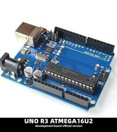</a> |
| Arduino Nano Type-C | 3 | Owned | Compact Arduino-compatible MCU Type-C USB Nano 3.0 With the bootloader compatible Nano controller for arduino CH340 USB driver 16Mhz ATMEGA328PB Use: Compact embedded projects [Product reference](https://www.aliexpress.us/item/3256809661879534.html) Sheet1 row 4 | <a href="inventory-004-arduino-nano-type-c.jpg">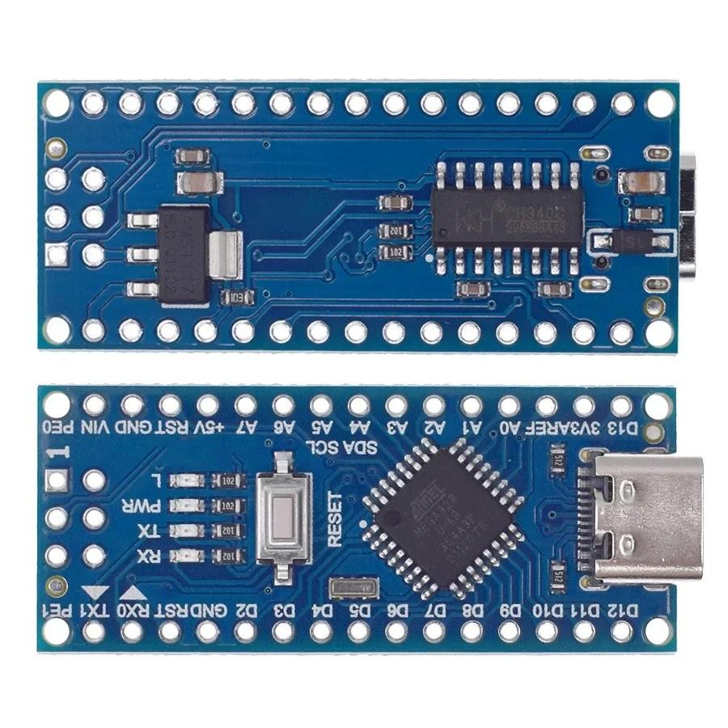</a> |
| Arduino Nano Type-C | 1 | Owned | Compact Arduino-compatible MCU - no solder Type-C USB Nano 3.0 With the bootloader compatible Nano controller for arduino CH340 USB driver 16Mhz ATMEGA328PB Use: Compact embedded projects [Product reference](https://www.aliexpress.us/item/3256809661879534.html) Sheet1 row 5 | <a href="inventory-005-arduino-nano-type-c.jpg">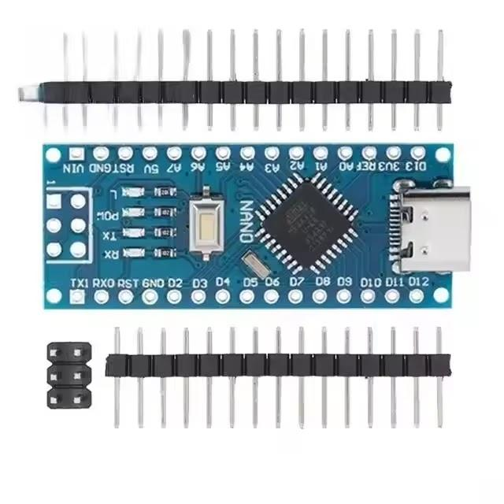</a> |
| ESP32-S3 DevKitC-1 | 2 | Owned | Wi-Fi/Bluetooth ESP32-S3 ESP32-S3 Development Board DevKitC-1 N16R8 WiFi BT Module 44Pin Type-C USB ESP32-S3 WROOM-1 Use: Mission Control, rover, wireless systems [Product reference](https://www.aliexpress.us/item/3256811905724568.html) Sheet1 row 6 | <a href="inventory-006-esp32-s3-devkitc-1.jpg">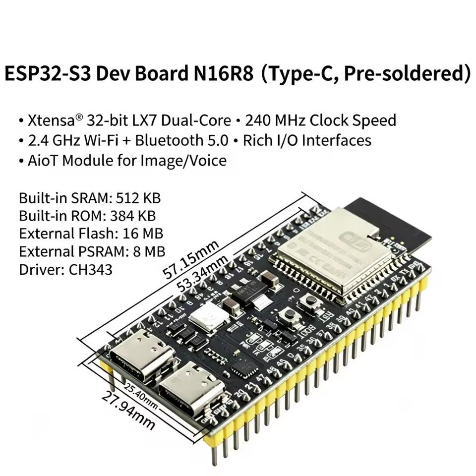</a> |
| MINI ESP32-C3 with OLED | 2 | Owned | 0.42 in OLED, 4MB flash, USB-C, ceramic antenna, 2.4GHz Wi-Fi/BT Use: Small distributed controllers, rover controller, status nodes [Product reference](https://www.aliexpress.us/item/3256807743067544.html) Sheet1 row 7 | <a href="inventory-007-mini-esp32-c3-with-oled.jpg">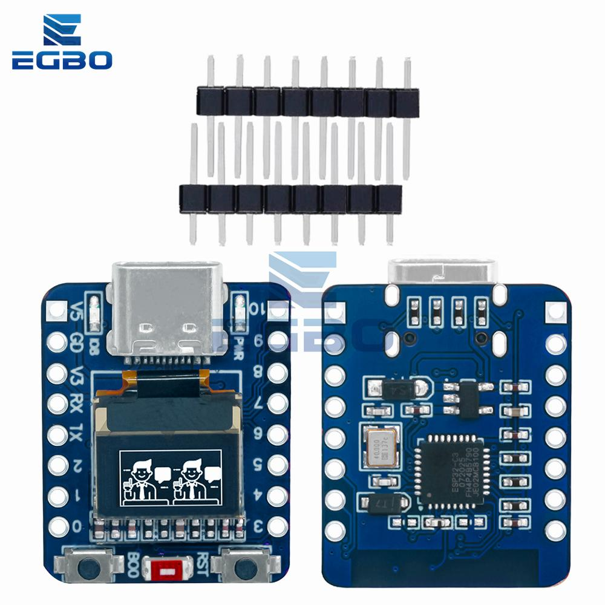</a> |
| ESP32-CAM | 1 | Owned | ESP32 camera board ESP32-CAM WiFi Module ESP32 serial to WiFi ESP32 CAM Development Board 5V For Bluetooth with OV5640 Camera Module Nodemcu Use: Future rover/base camera [Product reference](https://www.aliexpress.us/item/3256803285802793.html) Sheet1 row 8 | <a href="inventory-008-esp32-cam.jpg">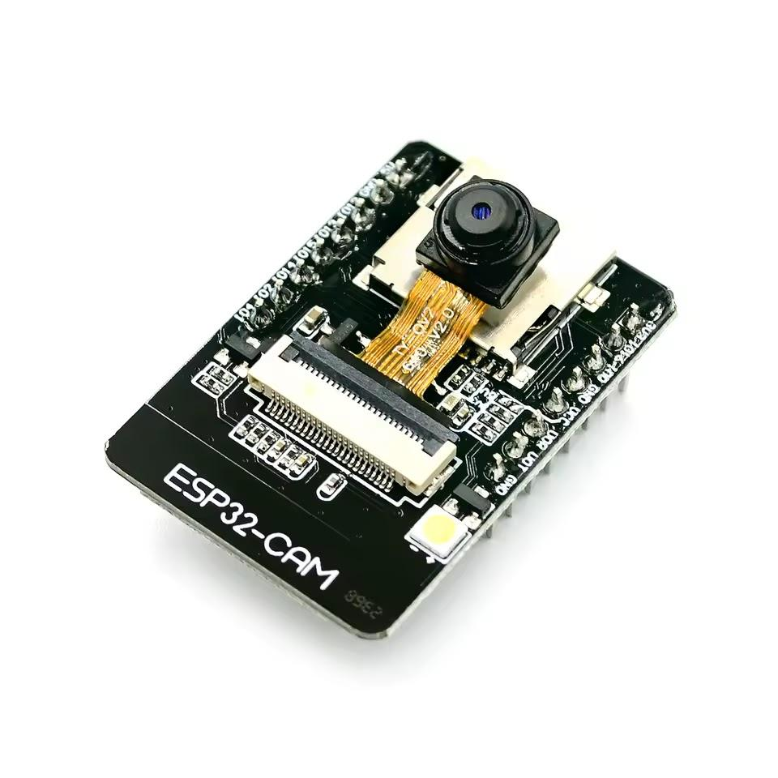</a> |

## Displays

| Component | Qty | Status | Details and notes | Photo |
| --- | --- | --- | --- | --- |
| 3.5 in TFT SPI | 1 | Owned | Estardyn; ST7789V/ST7796S family Estardyn 3.5 Inch TFT LCD Display, 240x320/320x480 SPI Module ST7789V/ST7796S Use: Mission Control graphical display [Product reference](https://www.aliexpress.us/item/3256806796021810.html) Sheet1 row 9 | <a href="inventory-009-3-5-in-tft-spi.jpg">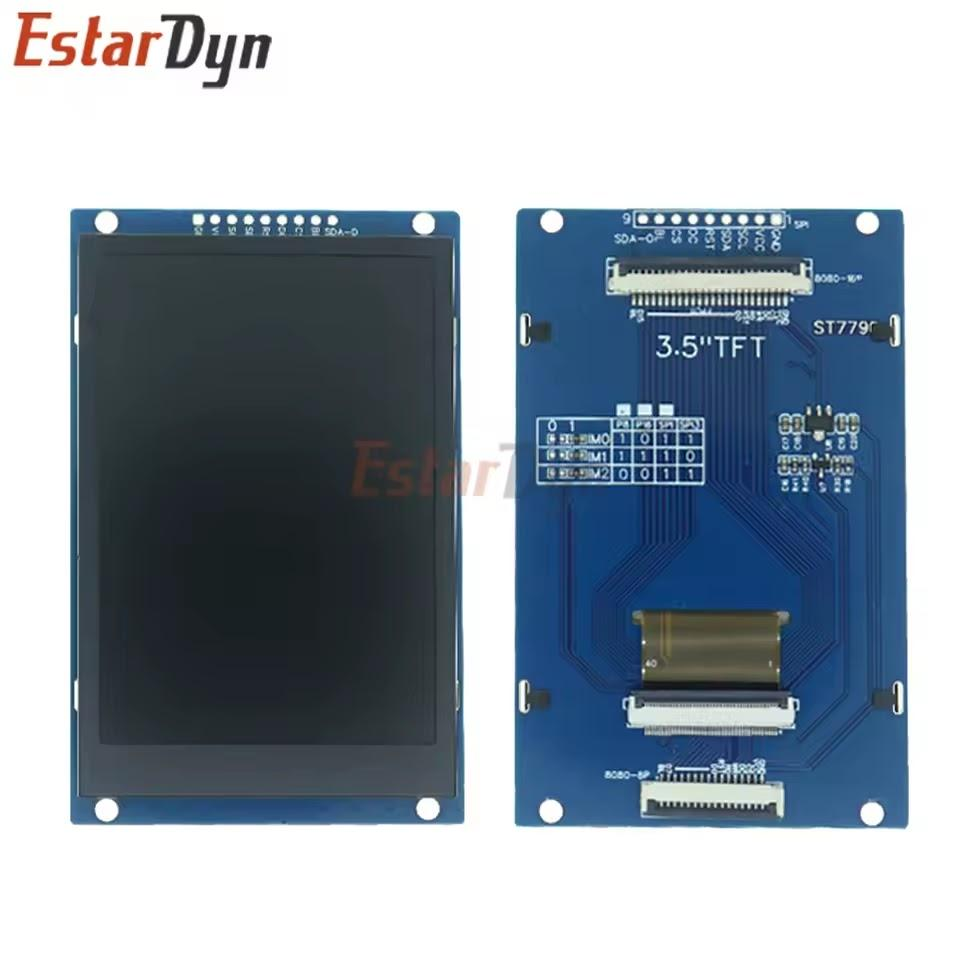</a> |
| 2.25 in TFT SPI | 1 | Owned | ST7789 Driver SPI Interface 2.25 Inch TFT LCD Module 76x284, ST7789 Driver SPI Interface Full View Color Screen for DIY Use: Mission Control graphical display [Product reference](https://www.aliexpress.us/item/3256809968903052.html) Sheet1 row 10 | <a href="inventory-010-2-25-in-tft-spi.jpg">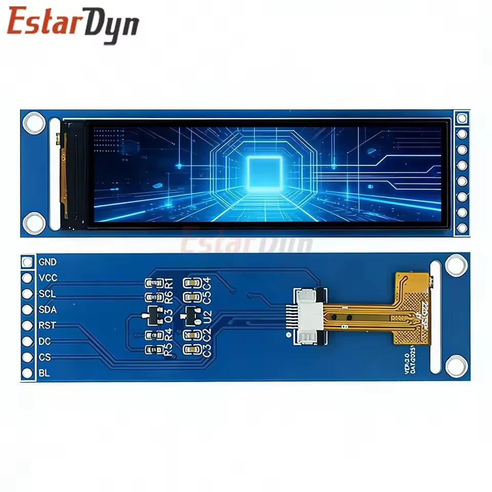</a> |
| LCD 1602 displays | 3 | Owned | 16x2 character LCDs Use: Status and sensor displays [Product reference](https://www.aliexpress.us/item/2251800429106431.html) Sheet1 row 11 | <a href="inventory-011-lcd-1602-displays.jpg">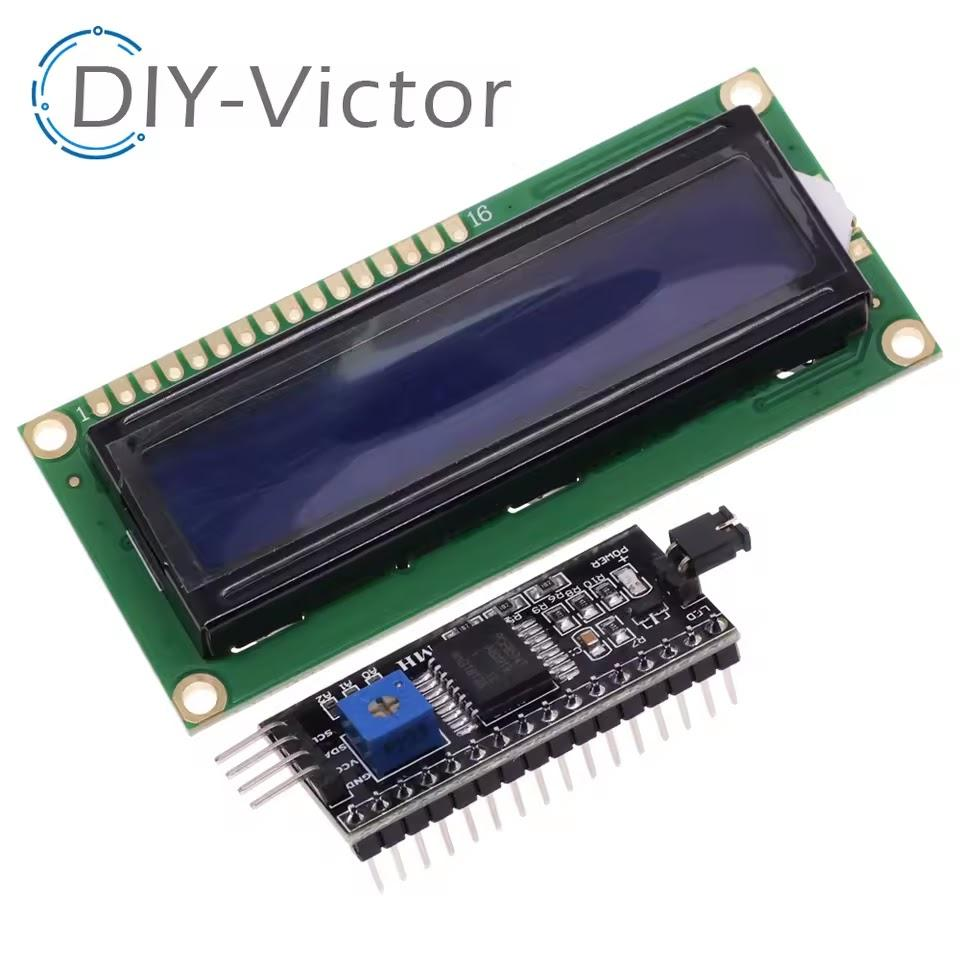</a> |
| PCF8574 I2C LCD backpacks | 2 | Owned | I2C interface for LCD Use: Reduce LCD pin usage [Product reference](https://www.aliexpress.us/item/3256806951869323.html) Sheet1 row 12 | <a href="inventory-012-pcf8574-i2c-lcd-backpacks.jpg">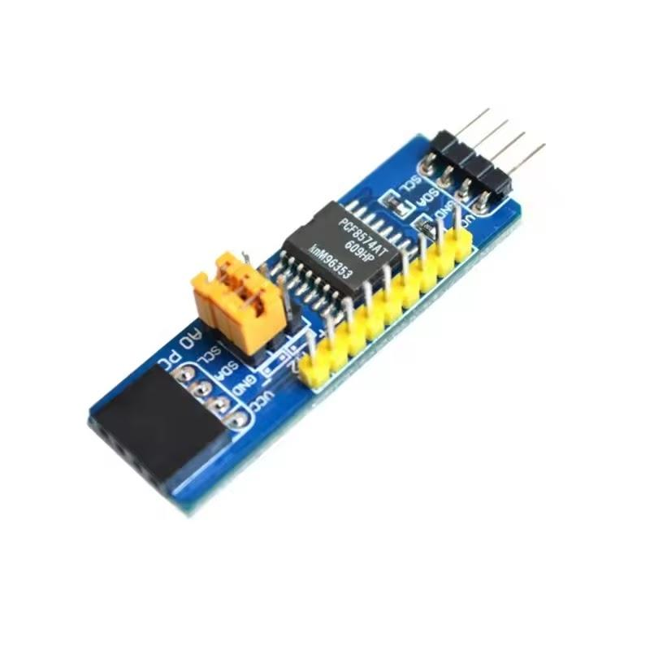</a> |
| Single-digit 7-segment LED | 1 | Owned | 1 digit Use: Counters/status Sheet1 row 13 | — |
| Multi-digit 7-segment LED display | 1 | Owned | Multi-digit display Use: Timers/counters Sheet1 row 14 | — |
| 0.96 OLED Display | 2 | Owned | 1-10pcs Original 0.96 inch oled IIC Serial White OLED Display Module 128X64 I2C SSD1306 12864 LCD Screen Board For Arduino Use: Display [Product reference](https://www.aliexpress.us/item/3256805954920554.html) Sheet1 row 101 | <a href="inventory-101-0-96-oled-display.jpg">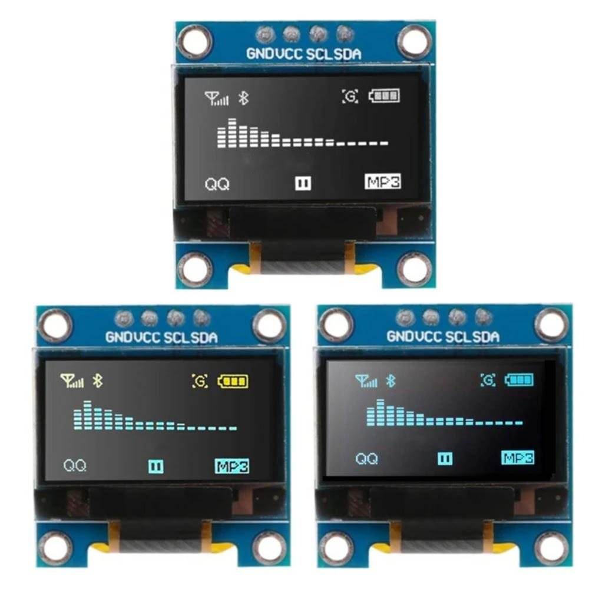</a> |

## Motor / Motion

| Component | Qty | Status | Details and notes | Photo |
| --- | --- | --- | --- | --- |
| TT DC motors | 4 | Owned | Small geared DC motors Use: Rover drivetrain Sheet1 row 15 | — |
| Circular DC motors | 3 | Salvaged/Owned | Small round motors from photographed parts Exact specs TBD Use: Experiments / mechanisms Sheet1 row 16 | — |
| SG90 servo motors | Multiple | Owned | 9g micro servo Use: Lightweight mechanisms Sheet1 row 17 | — |
| MG90S servo | 1 | Owned | 180 degree metal-gear micro servo Use: Door/mechanisms [Product reference](https://www.aliexpress.us/item/3256806837116059.html) Sheet1 row 18 | <a href="inventory-018-mg90s-servo.jpg">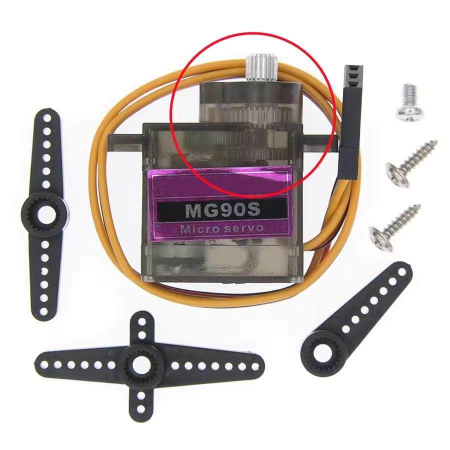</a> |
| MG995 servo | 1 | Owned | 180 degree high-torque servo Use: Door/heavier mechanisms [Product reference](https://www.aliexpress.us/item/3256808048813907.html) Sheet1 row 19 | <a href="inventory-019-mg995-servo.jpg">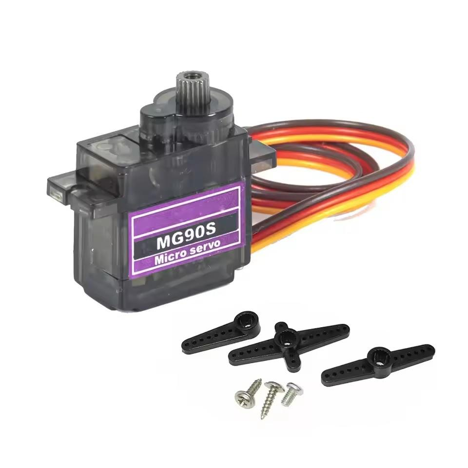</a> |
| MG996 servo | 1 | Owned | 360 degree servo Use: Continuous rotation mechanisms Sheet1 row 20 | — |
| Linear actuator | 1 | Owned | 12 in actuator Linear Actuator 12V, 12 Inch High Speed 0.55&quot;/s Linear Actuator, 220lbs/1000N Linear Motion Actuator with Mounting Bracket and IP54 Protection Use: Airlock door project [Product reference](https://www.amazon.com/dp/B0CWNBRKWB) Sheet1 row 21 | <a href="inventory-021-linear-actuator.jpg">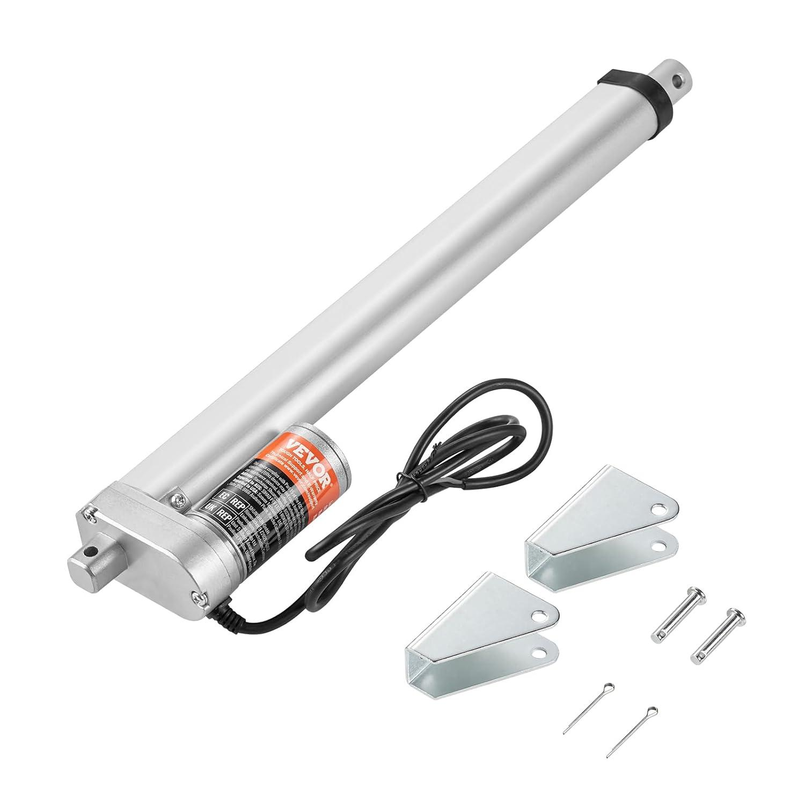</a> |
| TB6612 dual motor driver | 4 | Owned | Dual H-bridge motor driver 4 Sets TT Motor DC 3-6V Gearbox Motor Dual Shaft 200RPM Ratio 1:48 Motor with Tire Wheel Kit for Arduino DIY Smart Car Robot Use: TT motors / rover [Product reference](https://www.aliexpress.us/item/3256809064627835.html) Sheet1 row 22 | <a href="inventory-022-tb6612-dual-motor-driver.png">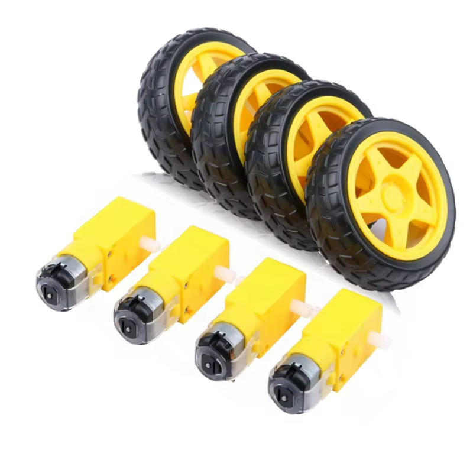</a> |
| BTS7960-class high-current motor driver | 1 | Owned | High-current H-bridge Previously referred to as BTS7969 Use: 12V linear actuator Sheet1 row 23 | — |
| TB6612 Dual Motor Driver Board | 2 | Owned | TENSTAR 2pcs TB6612 Dual Motor Driver Board Red 1A TB6612FNG Chip Microcontroller [Product reference](https://www.aliexpress.us/item/3256809711655066.html) Sheet1 row 114 | <a href="inventory-114-tb6612-dual-motor-driver-board.jpg">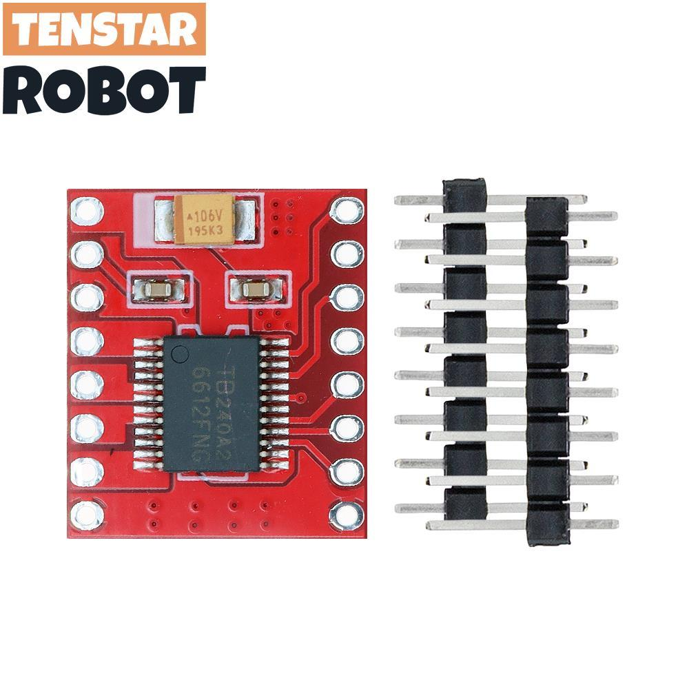</a> |

## Sensors

| Component | Qty | Status | Details and notes | Photo |
| --- | --- | --- | --- | --- |
| DHT temperature/humidity sensor | 1 | Owned | Digital temperature &amp; humidity Use: Habitat environmental monitoring [Product reference](https://www.aliexpress.us/item/3256807449697831.html) Sheet1 row 24 | — |
| SHT41 temperature/humidity sensor | 1 | Owned | Higher-accuracy I2C sensor TENSTAR SHT41 Digital Temperature and Humidity Sensor Module I2C Communication High Accuracy GY-SHT41 Use: Environmental monitoring [Product reference](https://www.aliexpress.us/item/3256809711848870.html) Sheet1 row 25 | <a href="inventory-025-sht41-temperature-humidity-sensor.jpg">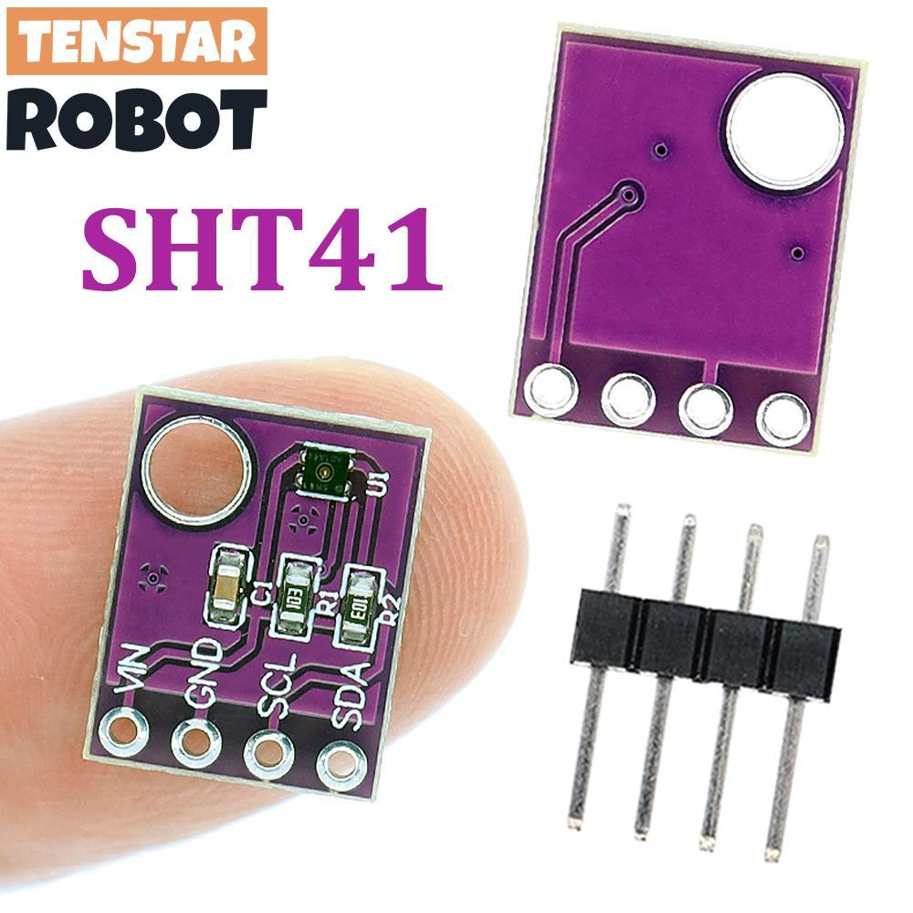</a> |
| MMA8452 accelerometer | 5 | Owned | 3-axis accelerometer GY-45 MMA8452 MMA8452Q Modules Digital Triaxial Accelerometer High-precision Inclination Tilt 3-Axis Module For Arduino Use: Motion/tilt sensing [Product reference](https://www.aliexpress.us/item/3256805436279402.html) Sheet1 row 26 | <a href="inventory-026-mma8452-accelerometer.jpg">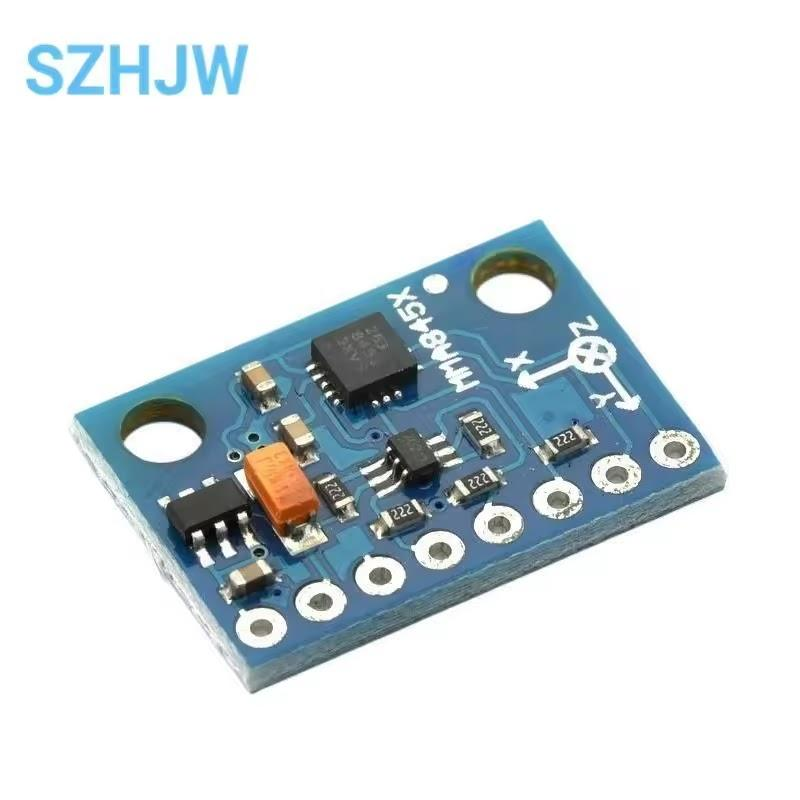</a> |
| TCRT5000 5-way sensor | 1 | Owned | 5-channel IR tracking array 5-Way Black and White Line Identification Sensor Module Tracking Intelligent Car Infrared Sensor TCRT5000 Use: Rover line tracking [Product reference](https://www.aliexpress.us/item/3256805740795136.html) Sheet1 row 27 | <a href="inventory-027-tcrt5000-5-way-sensor.jpg">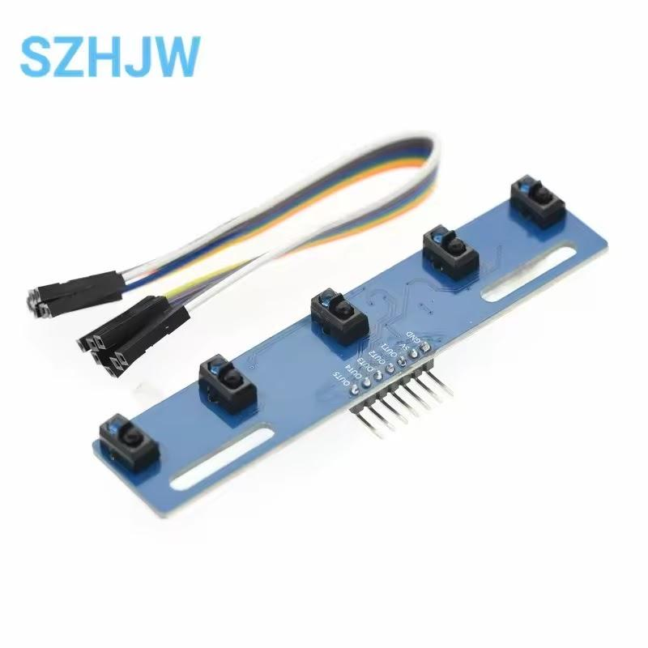</a> |
| PIR HC-SR501 | 2 | Owned | Motion detector PIR Sensor HC-SR501 Adjust IR Pyroelectric Infrared Motion Detector Module For Raspberry Pi Sensing Human Bod Use: Habitat/security sensing [Product reference](https://www.aliexpress.us/item/3256806942970892.html) Sheet1 row 28 | <a href="inventory-028-pir-hc-sr501.png">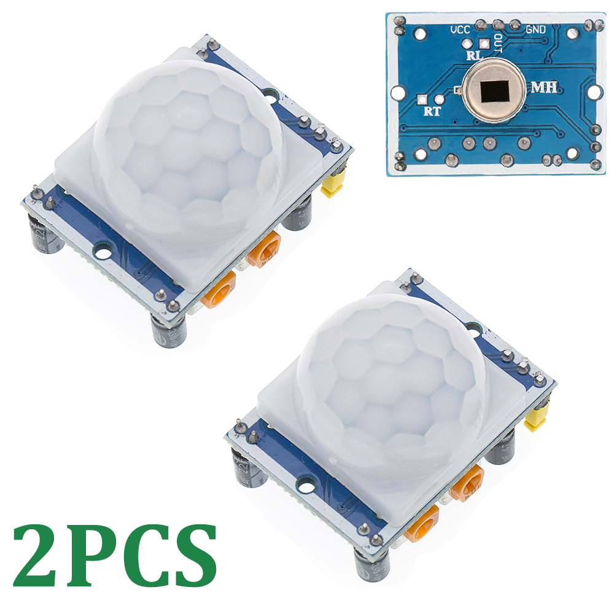</a> |
| Soil moisture sensors | 4 | Owned | Soil moisture probes/modules Use: Mars greenhouse Sheet1 row 29 | — |
| Water sensors | Multiple | Owned | Water presence/level sensing Use: Water system / leak detection Sheet1 row 30 | — |
| Light sensors | Multiple | Owned | Photo/light sensing Use: Solar tracking / lighting Sheet1 row 31 | — |
| GY-302 Light sensor | 2 | Owned | Photo/light sensing GY-302 BH1750 BH1750FVI light intensity illumination module 3V-5V for Arduino Use: Light sensor [Product reference](https://www.aliexpress.us/item/3256809270505240.html) Sheet1 row 32 | <a href="inventory-032-gy-302-light-sensor.jpg">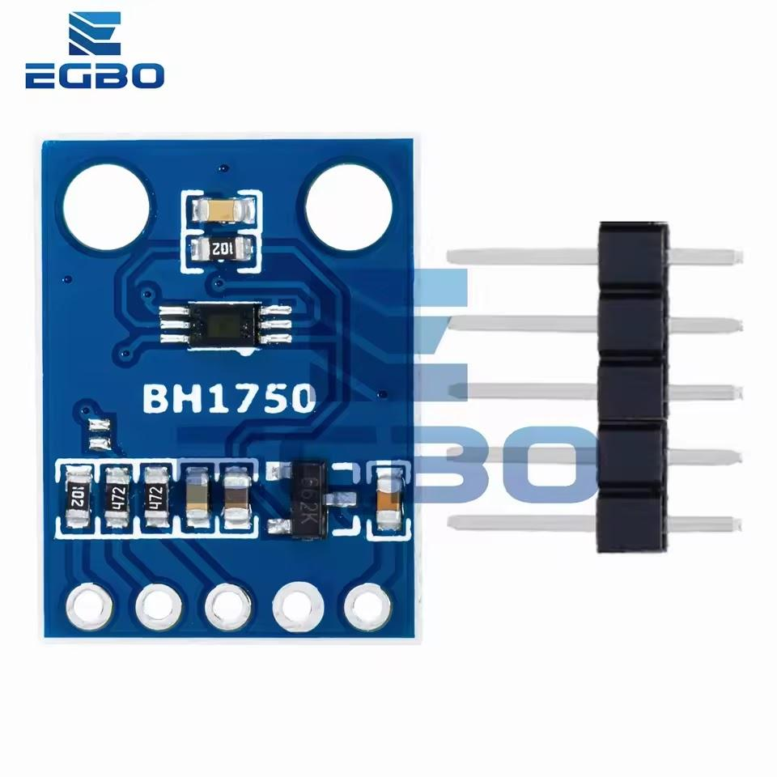</a> |
| Photometric sensors | 2 | Owned | Light/photometric sensing Use: Solar/light experiments Sheet1 row 33 | — |
| Reed switches | Multiple | Owned | Magnetic contact switch Use: Door open/closed sensing [Product reference](https://www.aliexpress.us/item/3256807131902161.html) Sheet1 row 34 | — |
| Very small magnets | Multiple | Owned | For magnetic/reed sensing Use: Door position sensing Sheet1 row 35 | — |
| Sound Sensor | 1 | Owned | Sound Sensor Module Sound Control Sensor MAX4466 MAX9814 Switch Detection Whistle Switch Microphone Amplifier YANXD Use: Future experiments [Product reference](https://www.aliexpress.us/item/3256806852394253.html) Sheet1 row 98 | <a href="inventory-098-sound-sensor.jpg">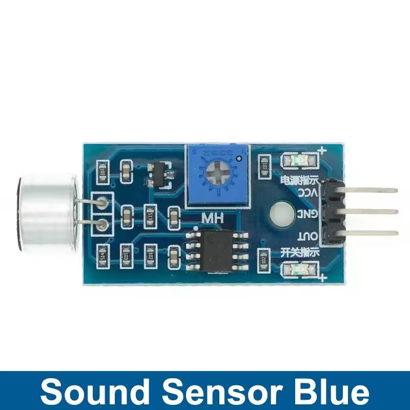</a> |
| Infrared Transmitter | 1 | Owned | Use: Future experiments [Product reference](https://www.aliexpress.us/item/3256808368291738.html) Sheet1 row 99 | <a href="inventory-099-infrared-transmitter.jpg">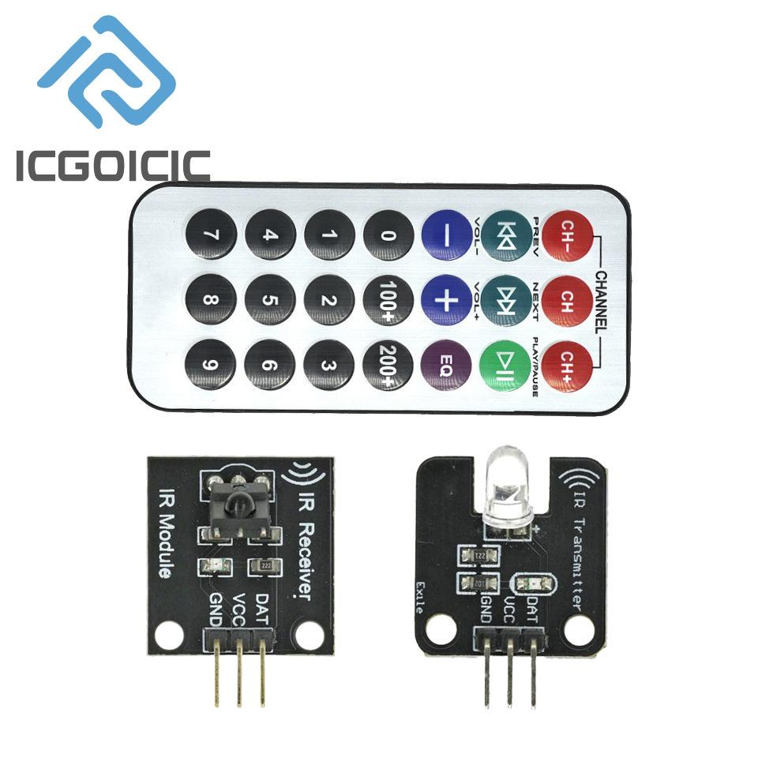</a> |
| GY-BMI160 | 2 | Owned | BMI160 GY-BMI160 6DOF 6-axis Rate Gyro Gravity Accelerometer Sensor Module IIC I2C SPI Communication Protocol 3-5V Use: Sensors/control wiring [Product reference](https://www.aliexpress.us/item/3256806165088215.html) Sheet1 row 110 | <a href="inventory-110-gy-bmi160.png">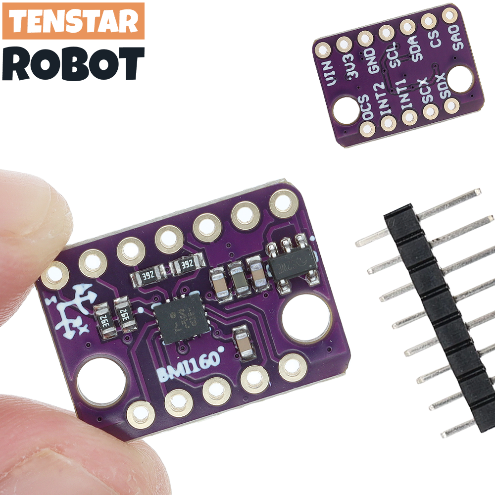</a> |
| TCRT5000 Ifrared Reflective Sensor | 4 | Owned | TCRT5000 Infrared Reflective Sensor IR Photoelectric Switch Barrier Line Track Module Diode Triode Board 3.3v Use: Sensors/control wiring [Product reference](https://www.aliexpress.us/item/3256808220079549.html) Sheet1 row 111 | <a href="inventory-111-tcrt5000-ifrared-reflective-sensor.jpg">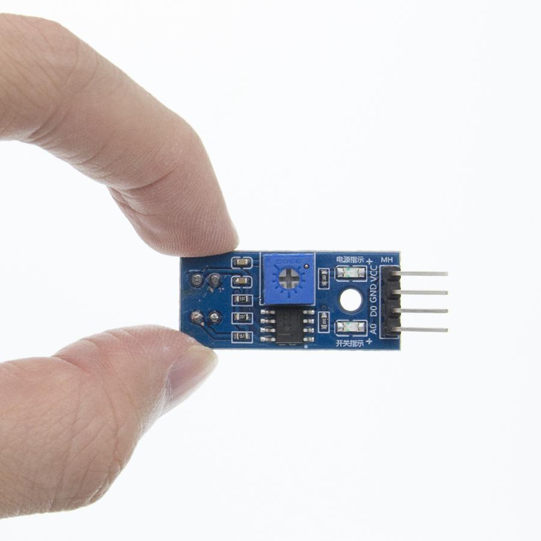</a> |

## Inputs

| Component | Qty | Status | Details and notes | Photo |
| --- | --- | --- | --- | --- |
| Joysticks | 3 | Owned | Includes QYF-860 and MH-FMG KY-023 For Arduino Dual-Axis XY Joystick Module Higher Quality PS2 Joystick Control Lever Sensor Rated 4.9 /5 Use: Rover/Mission Control control [Product reference](https://www.aliexpress.us/item/3256808029549027.html) Sheet1 row 36 | <a href="inventory-036-joysticks.jpg">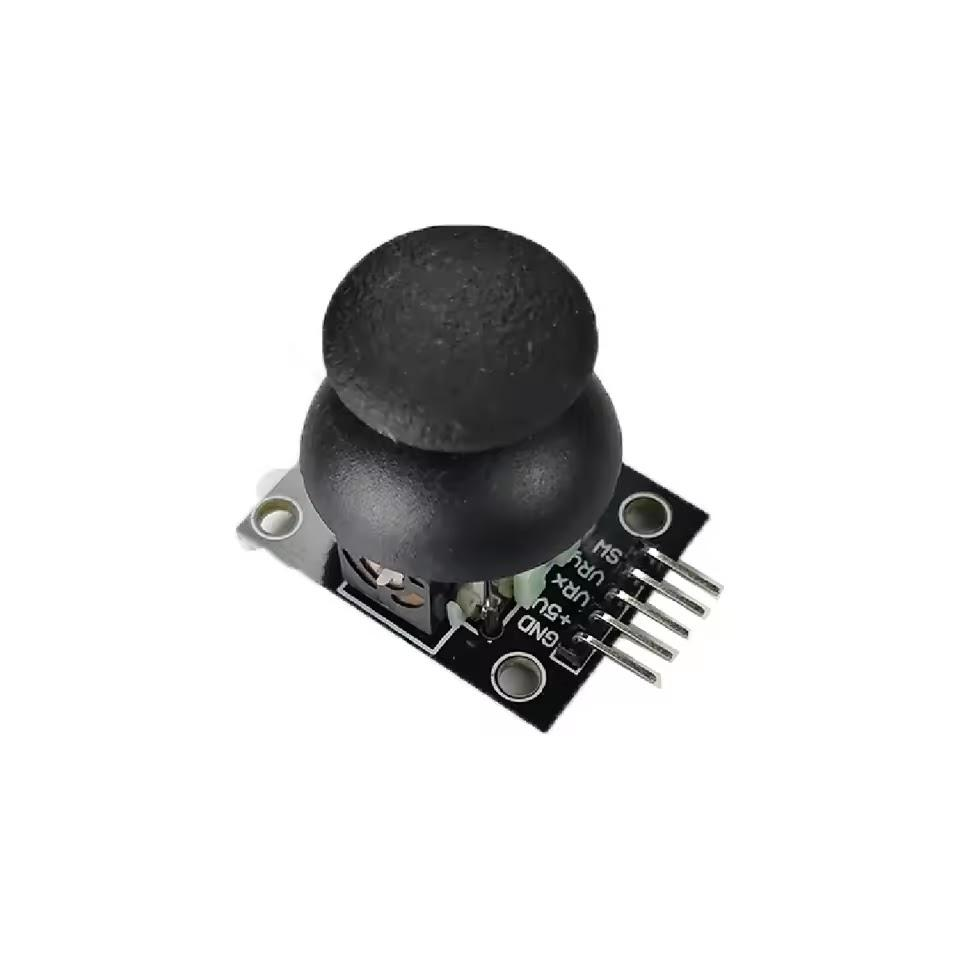</a> |
| Large arcade-style buttons | 2 | Owned | Large pushbuttons Use: Mission Control [Product reference](https://www.aliexpress.us/item/3256808273235125.html) Sheet1 row 37 | <a href="inventory-037-large-arcade-style-buttons.jpg">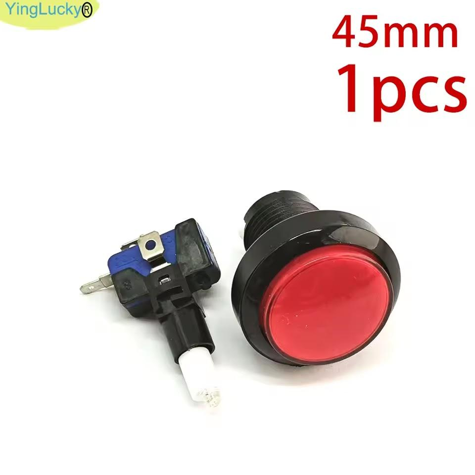</a> |
| 22mm LED-ring momentary button | 1 | Owned | Illuminated momentary pushbutton, self-reset Use: Airlock / Mission Control [Product reference](https://www.aliexpress.us/item/3256806291060685.html) Sheet1 row 38 |  |
| 12mm LED-ring momentary button | 5 | Owned | Illuminated momentary pushbutton, self-reset  12mm With Wire Waterproof Metal Push Button Switch LED Ring/Power Light Momentary Latching 3-6V Red, Yellow, White, Blue, Green Use: Airlock / Mission Control [Product reference](https://www.aliexpress.us/item/3256806291060685.html) Sheet1 row 39 | <a href="inventory-039-12mm-led-ring-momentary-button.jpg">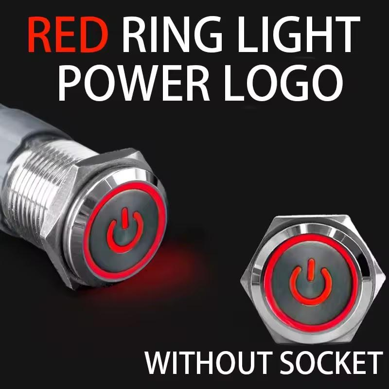</a> |
| Buttons assortment | Multiple | Owned | Different colored tips/styles (DS316 &amp; DS314) Use: User inputs Sheet1 row 40 | <a href="inventory-040-buttons-assortment.jpg">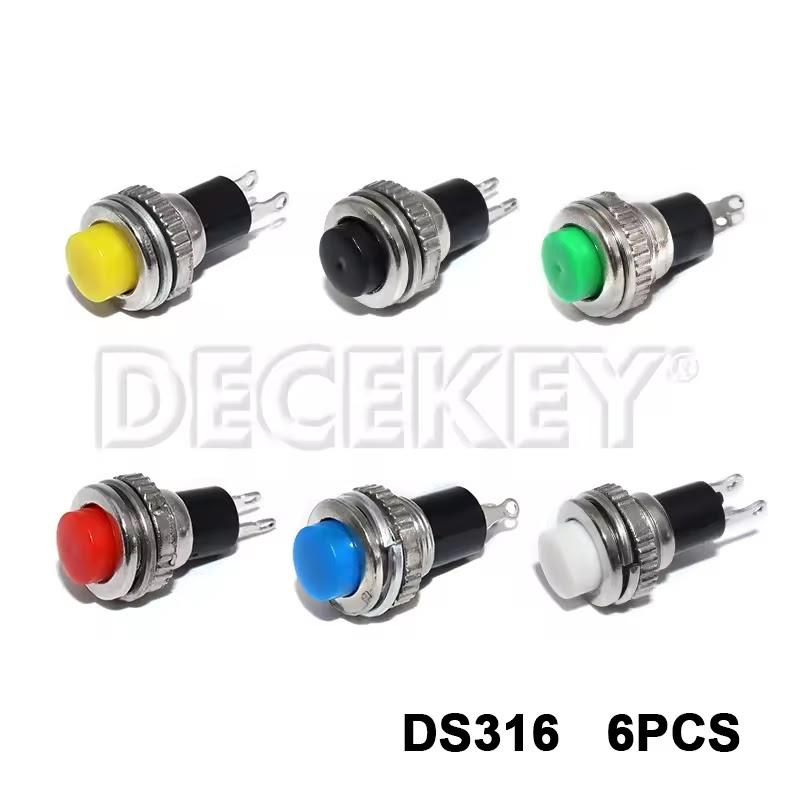</a> |
| Switch assortment | Multiple | Owned | Various switch types Use: Power/mode control [Product reference](https://www.aliexpress.us/item/2251832711118648.html) Sheet1 row 41 | — |
| DPST 30A rocker switch | 1 | Owned | High-current rocker with screw terminals Use: Master power switching [Product reference](https://www.aliexpress.us/item/2251832711118648.html) Sheet1 row 42 | <a href="inventory-042-dpst-30a-rocker-switch.jpg">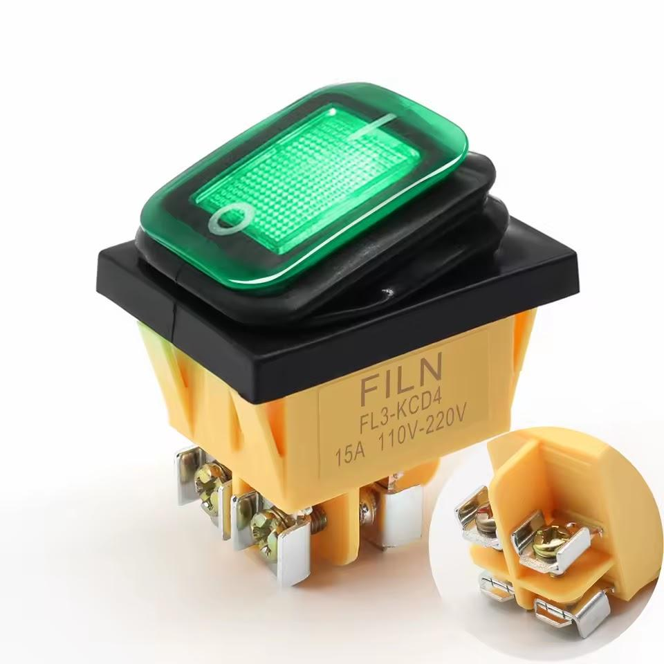</a> |
| Potentiometers | Multiple | Owned | Variable resistance input Use: Analog controls Sheet1 row 43 | — |
| Remote Control, light up button | 1 | Owned | RF 433MHz Wireless 10A Relay Receiver Remote Control Light Switch 220V 110V Mini Round Button Wall Panel Switch For LED Lamp RF 433MHz Use: Power/mode control Sheet1 row 104 | — |

## Communication / Access

| Component | Qty | Status | Details and notes | Photo |
| --- | --- | --- | --- | --- |
| HM-10 BLE module | 1 | Owned | Bluetooth Low Energy HM-10 BLE 4.0 Module Transparent Serial Port 4.0 Module With Logic Level Translator Use: Wireless experiments [Product reference](https://www.aliexpress.us/item/2251832666785613.html) Sheet1 row 44 | <a href="inventory-044-hm-10-ble-module.jpg">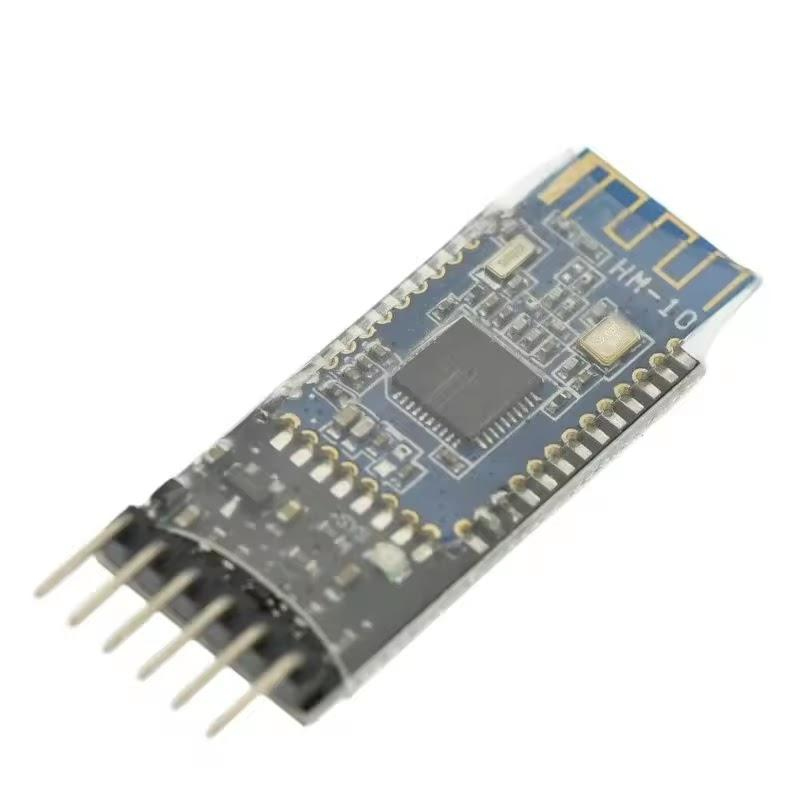</a> |
| RFID kits | 2 | Owned | RFID reader kits Use: Airlock/security access Sheet1 row 45 | — |

## Audio

| Component | Qty | Status | Details and notes | Photo |
| --- | --- | --- | --- | --- |
| Speaker | 1 | Owned | Small speaker; includes salvaged speaker Use: Audio/status sounds Sheet1 row 46 | — |
| Buzzers | Multiple | Owned | Electronic buzzers Use: Alerts Sheet1 row 47 | — |
| MP3 UART module + speaker | 1 | Owned | Serial audio playback module Use: Mission Control startup sounds [Product reference](https://www.aliexpress.us/item/2251832596173584.html) Sheet1 row 48 | <a href="inventory-048-mp3-uart-module-speaker.jpg">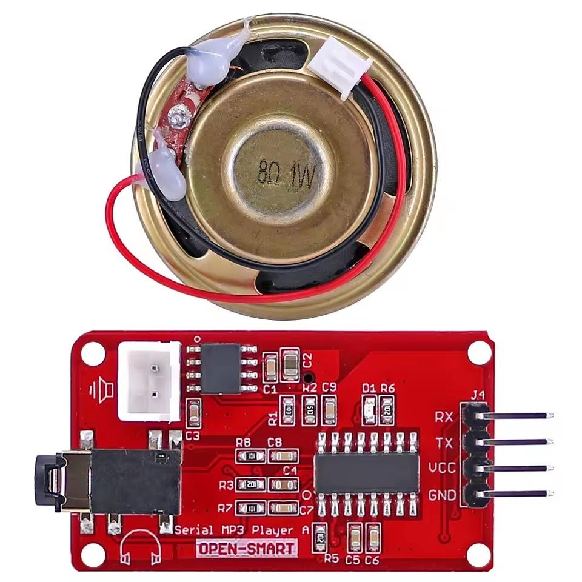</a> |
| MP3 Type C player with battery | 1 | Owned | DIY Recording Card Movement Creative Gift Box Christmas birthday Card Music Cover MP3 Download Voice Module TYPE-C With Speaker Use: DIY Recording Card Movement Creative Gift Box Christmas birthday Card Music Cover MP3 Download Voice Module TYPE-C With Speaker [Product reference](https://www.aliexpress.us/item/3256810257231199.html) Sheet1 row 49 | <a href="inventory-049-mp3-type-c-player-with-battery.jpg">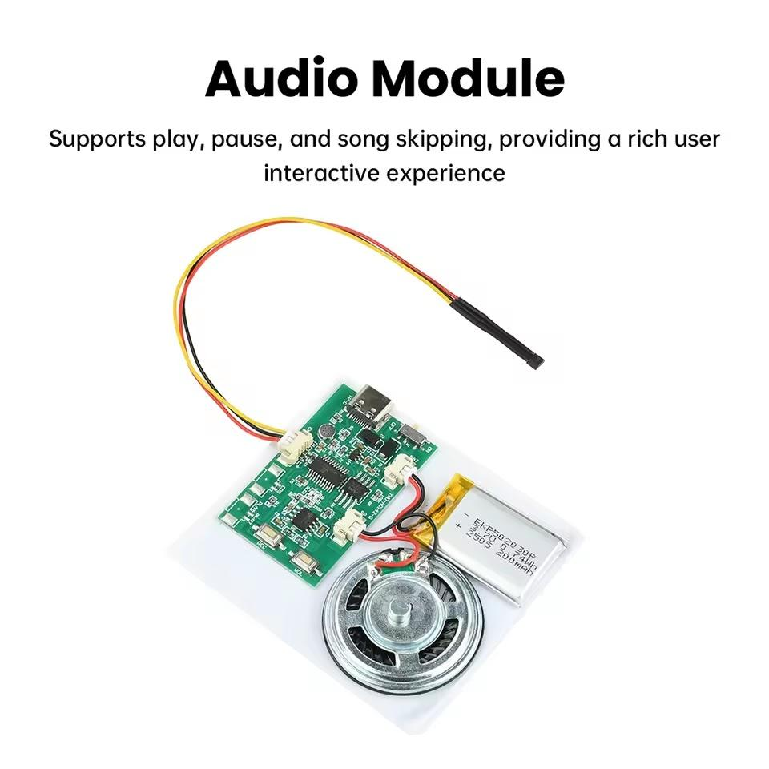</a> |
| MAX98357 I2S amplifier | 1 | Owned | 3W Class-D I2S amplifier Use: ESP32 digital audio [Product reference](https://www.aliexpress.us/item/3256809373329747.html) Sheet1 row 50 | <a href="inventory-050-max98357-i2s-amplifier.jpg">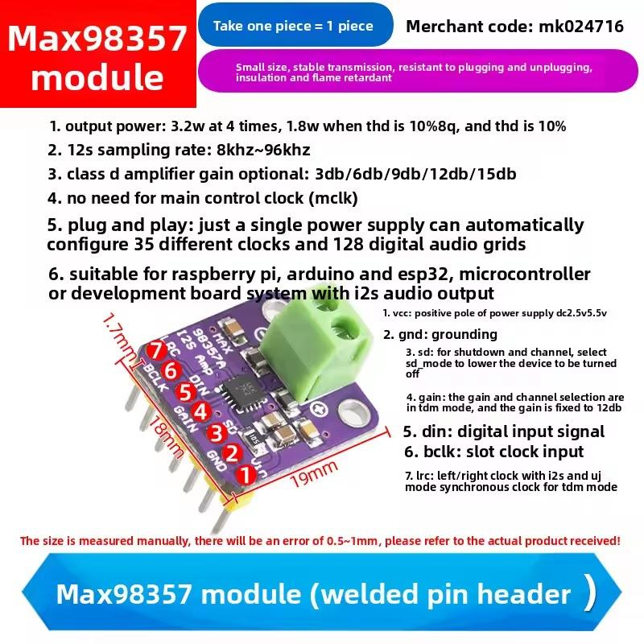</a> |
| High Quality Buzzer | 1 | Owned | High Quality Active / Passive Buzzer Module for Arduino New DIY Kit Active Buzzer Low Level Modules Use: Future experiments [Product reference](https://www.aliexpress.us/item/3256805341866909.html) Sheet1 row 100 | <a href="inventory-100-high-quality-buzzer.jpg">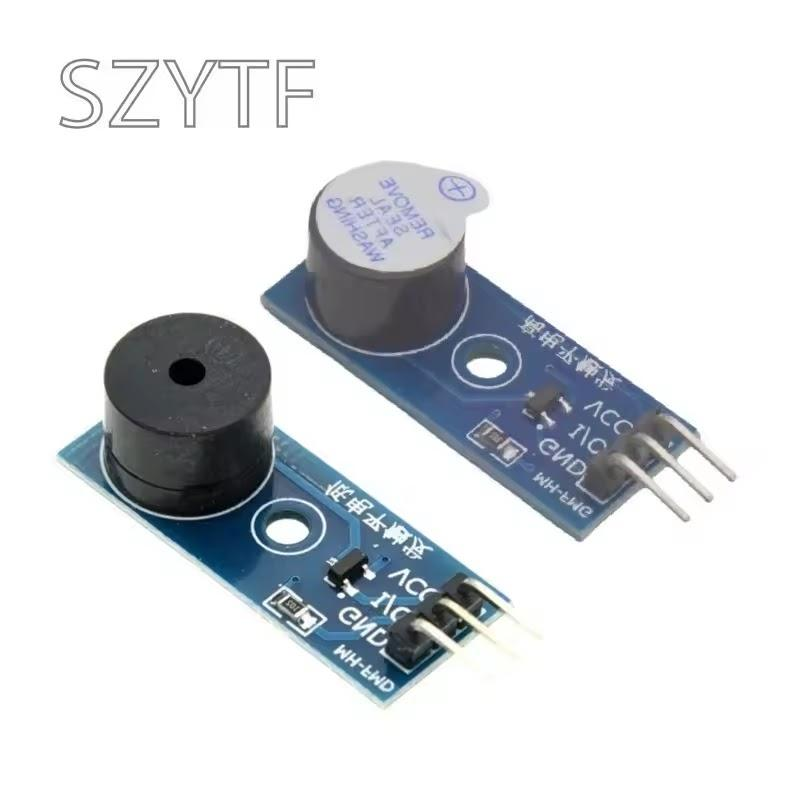</a> |
| 1W Speaker | 1 | Owned | Round 8 Ohm 1W Speaker 8ohm 20MM Loud Speakers Mobile Phone Small Loudspeaker Audio Use: Audio/status sounds [Product reference](https://www.aliexpress.us/item/3256805870138546.html) Sheet1 row 103 | <a href="inventory-103-1w-speaker.jpg">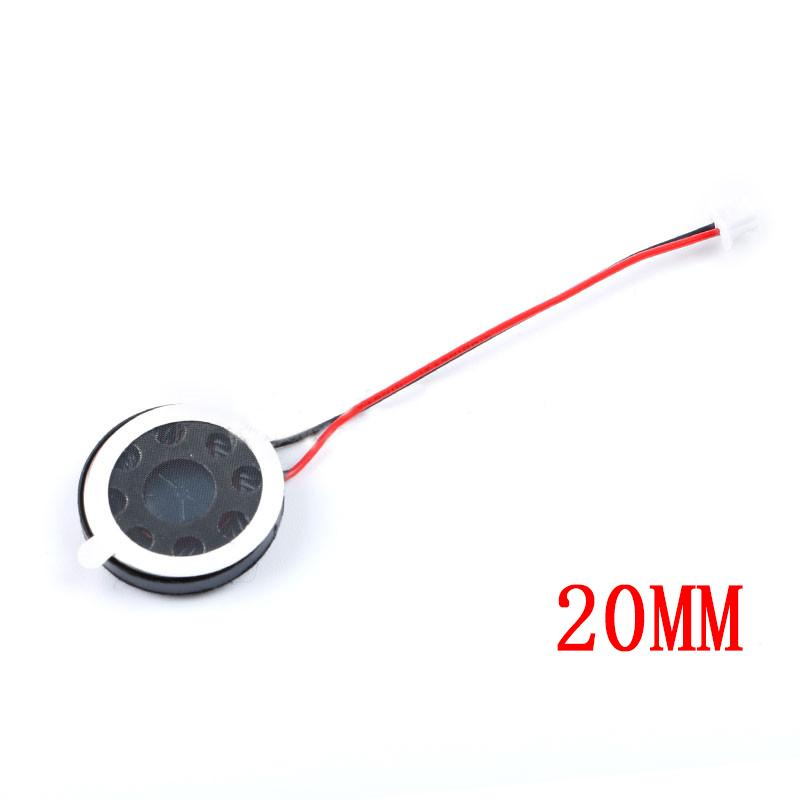</a> |

## Lighting / Optical

| Component | Qty | Status | Details and notes | Photo |
| --- | --- | --- | --- | --- |
| WS2812B addressable LED strip | 1 | Owned | Individually addressable RGB LEDs Use: Mission Control status lighting Sheet1 row 51 | — |
| WS2812 4X4 LED Matrix | 1 | Owned | Individually addressable RGB LEDs WS2812 Module 5050 RGB 4x4 16 LED Matrix Built-in Full-color Driving Color Lamp For Arduino Use: Mission Control status lighting [Product reference](https://www.aliexpress.us/item/3256808378795457.html) Sheet1 row 52 | <a href="inventory-052-ws2812-4x4-led-matrix.jpg">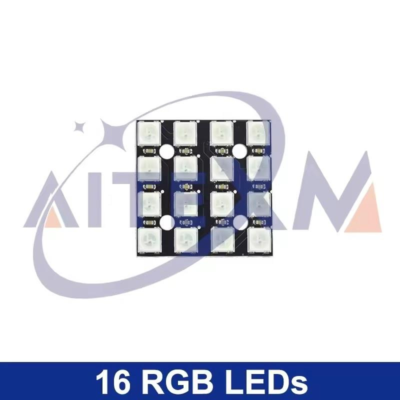</a> |
| Fairy lights | 1 | Owned | Decorative LEDs Warm White, 1PC 6M200LED Use: Habitat lighting [Product reference](https://www.aliexpress.us/item/3256810497352008.html) Sheet1 row 53 | <a href="inventory-053-fairy-lights.jpg">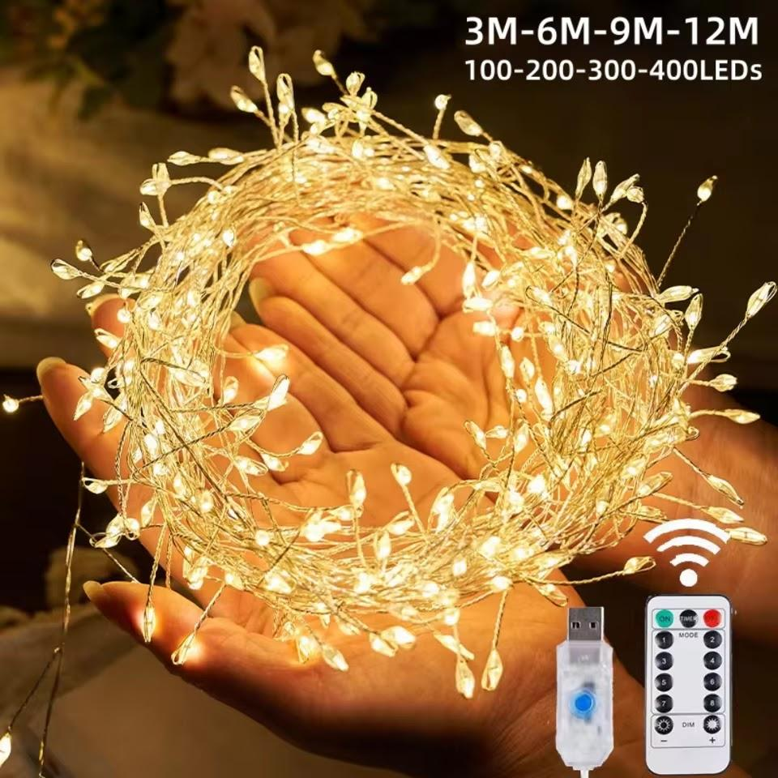</a> |
| Lasers | Multiple | Owned | Small laser modules Use controlled low-power modules Use: Optical experiments / beam-break demos Sheet1 row 54 | — |
| Possible laser diode + heatsink assembly | 1 | Salvaged | 3-lead brass/gold device in aluminum heatsink Do not power until identified Use: Future identification/testing Sheet1 row 55 | — |
| BBB863-2 3-LED PCB | 1 | Salvaged | Three surface-mount LEDs Use: Lighting experiments Sheet1 row 56 | — |
| Small wired LEDs | 3 | Salvaged | Clear LED packages on leads Use: Indicators Sheet1 row 57 | — |
| LED Light Bar | 1 | Owned | Wireless USB Rechargeable Motion Sensor LED Bar Light Induction Night Light Portable Cordless Magnetic Cabinet Lamp for Kitchen Use: Habitat lighting [Product reference](https://www.aliexpress.us/item/3256807523398865.html) Sheet1 row 105 | <a href="inventory-105-led-light-bar.jpg">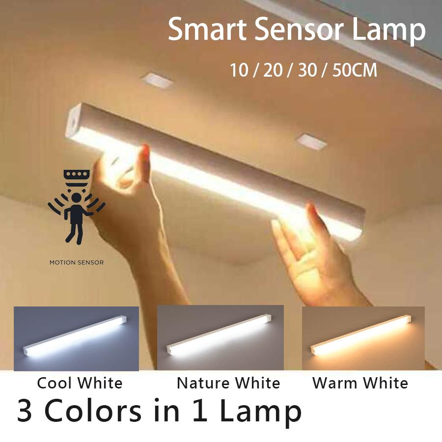</a> |

## Power

| Component | Qty | Status | Details and notes | Photo |
| --- | --- | --- | --- | --- |
| 4xAA battery holders | Multiple | Owned | ~6V with fresh alkaline cells Use: Current preferred beginner battery source Sheet1 row 58 | — |
| 2xAA battery holders | Multiple | Owned | ~3V alkaline Use: Low-voltage experiments Sheet1 row 59 | — |
| 9V battery connectors | Multiple | Owned | 9V snap leads Use: Battery connection Sheet1 row 60 | — |
| 18650 battery holders | Multiple | Owned | Li-ion cell holders 18650 use intentionally deferred while the family learns power fundamentals. 4×AA is the current preferred beginner battery source. Use: Future advanced battery projects Sheet1 row 61 | — |
| JST power pigtails | Multiple | Owned | JST connector one side, red/black wire other side Use: Low-voltage power connections Sheet1 row 62 | — |
| Breadboard power modules | 2 | Owned | Breadboard rail supply modules 3.3V/5V MB102 Breadboard Power Module+MB-102 830 Points Prototype  For Arduino kit +65 Jumper Wires Wholesale Use: Prototyping 5V/3.3V circuits [Product reference](https://www.aliexpress.us/item/3256805016940444.html) Sheet1 row 63 | <a href="inventory-063-breadboard-power-modules.jpg">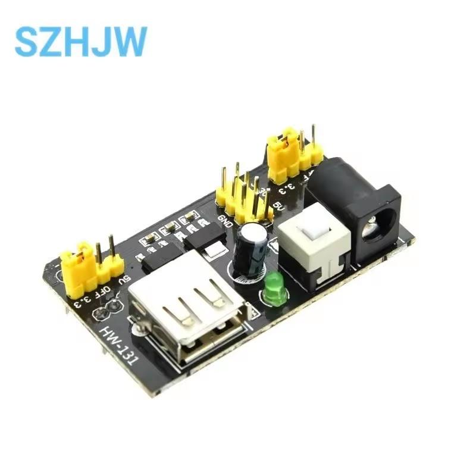</a> |
| LM2596 adjustable buck converter | 1 | Owned | DC-DC step-down regulator Use: 12V to 5V conversion [Reference image](https://ae-pic-a1.aliexpress-media.com/kf/Se2ceb029dfbc4799a57cb4a7d6d32f3fn.jpg_960x960q75.jpg_.avif) Sheet1 row 64 | <a href="inventory-064-lm2596-adjustable-buck-converter.jpg">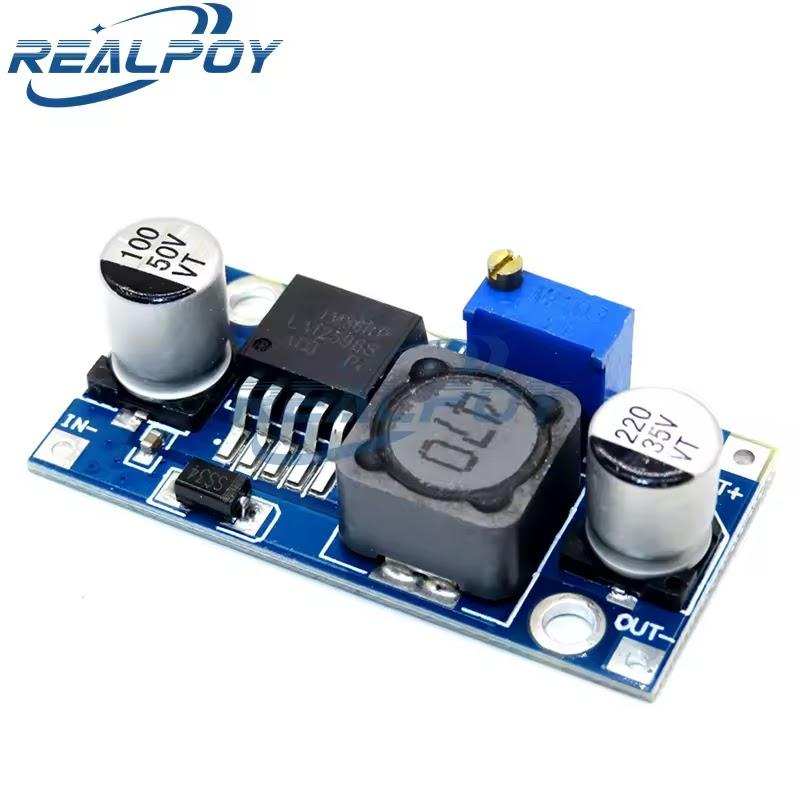</a> |
| Adjustable boost/buck USB converter | 1 | Owned | USB input, ~1.2-24V adjustable output Use: Power experiments [Product reference](https://www.aliexpress.us/item/3256806824235431.html) Sheet1 row 65 | <a href="inventory-065-adjustable-boost-buck-usb-converter.jpg">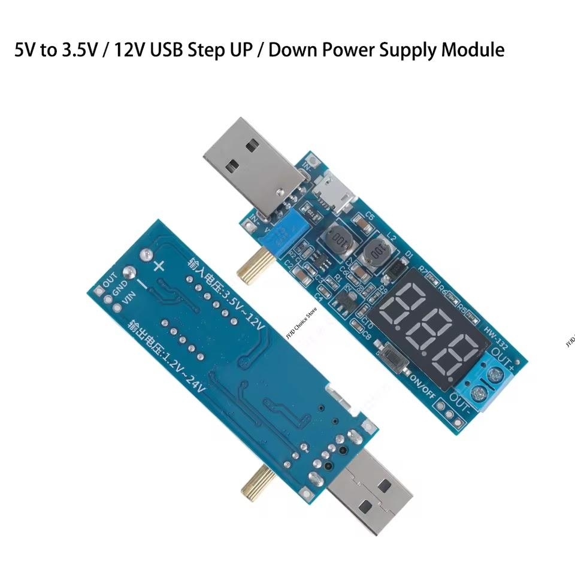</a> |
| USB-C PD trigger modules | 2 | Owned | Selectable 5/9/12/15/20V, advertised 100W Use: Bench/Mission Control power [Product reference](https://www.aliexpress.us/item/3256808061823356.html) Sheet1 row 66 |  |
| USB-C PD/QC dial trigger | 1 | Owned | Selectable ~5-20V Use: Bench power experiments [Product reference](https://www.aliexpress.us/item/3256808439898284.html) Sheet1 row 67 | <a href="inventory-067-usb-c-pd-qc-dial-trigger.jpg">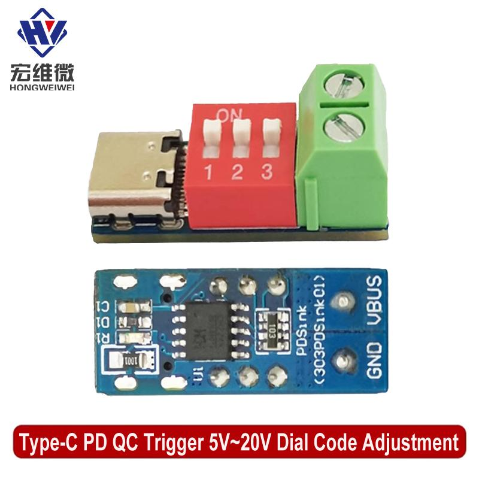</a> |
| INA226 power monitor | 1 | Owned | 0-36V I2C voltage/current monitor Use: Power monitoring [Product reference](https://www.aliexpress.com/item/3256809613884215.html) Sheet1 row 68 | <a href="inventory-068-ina226-power-monitor.jpg">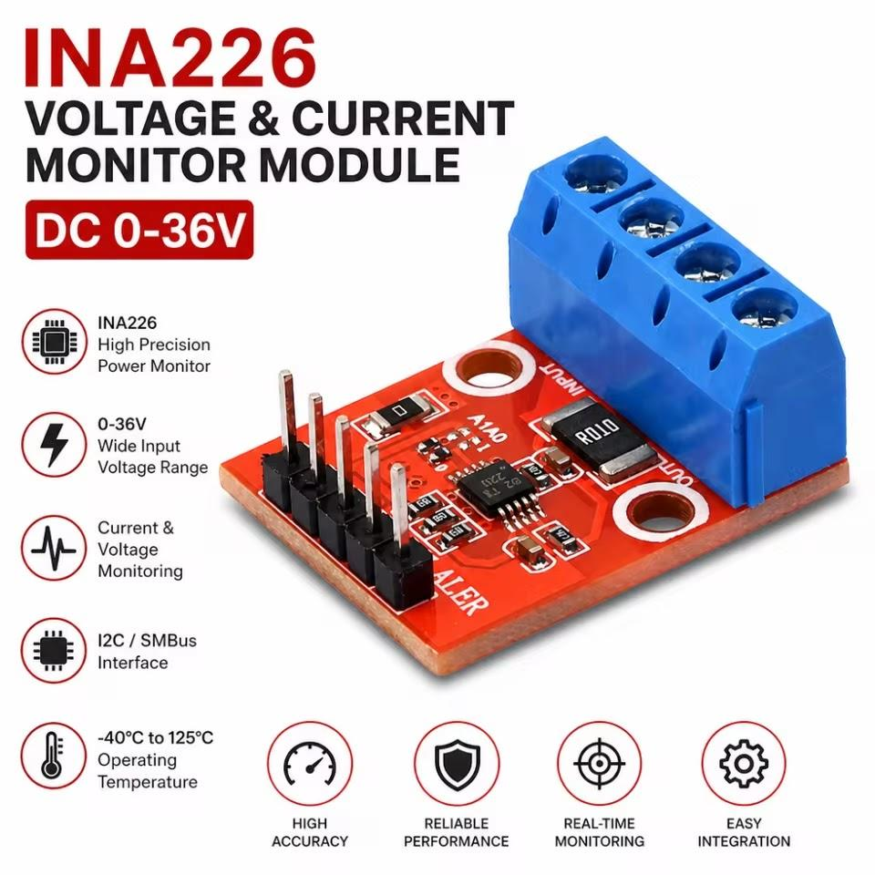</a> |
| INA3221 triple-channel power monitor | 1 | Owned | 3-channel voltage/current monitor Use: 5V/rail monitoring [Product reference](https://www.aliexpress.us/item/3256804234599267.html) Sheet1 row 69 | <a href="inventory-069-ina3221-triple-channel-power-monitor.jpg">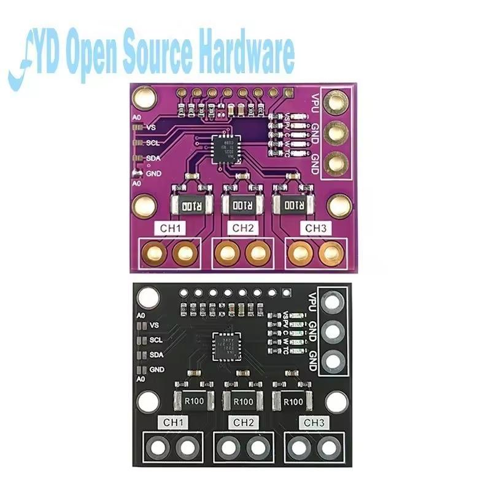</a> |
| 12V nominal solar panel | 1 | Owned | DC panel with alligator clips Characterize Voc/current before use Use: Future Mars Solar Power Lab Sheet1 row 70 | — |
| 6V solar panel | 1 | Owned | 6V 200MA 1.2W Mini 6V 200MA 1.2W Monocrystalline Silicon Solar Panel with Solar Charger CN3065 for 18650 Battery &amp; Cell Phone Charging Use: Future Mars Solar Power Lab [Product reference](https://www.aliexpress.us/item/3256812311364426.html) Sheet1 row 71 | <a href="inventory-071-6v-solar-panel.jpg">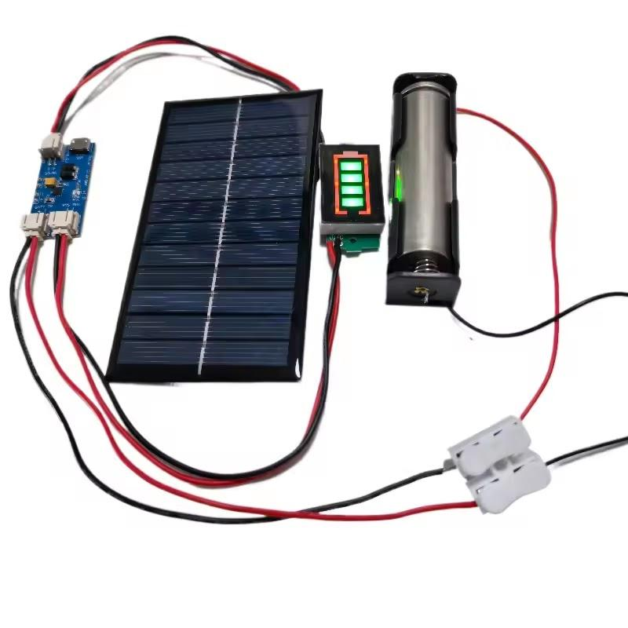</a> |
| 5V solar panel | 1 | Owned | 5V 60MA Mini Mono 80*45mm Solar Panel 5V 60MA for Mini Solar Panel Charging and Generating Electricity with Mini Solar Lipo Charger Use: Future Mars Solar Power Lab [Product reference](https://www.aliexpress.us/item/3256808076673638.html) Sheet1 row 72 | <a href="inventory-072-5v-solar-panel.jpg">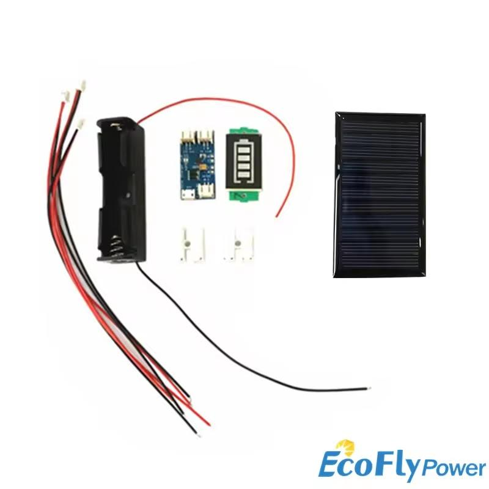</a> |
| CN3065 solar charger | 1 | Owned | Came with small solar kit; single-cell solar Li-ion charger Not for direct connection to 12V panel Use: Small solar/18650 learning project Sheet1 row 73 | — |
| Inline 10A fuse | 1 | Owned | Inline fuse protection Use: Main power protection [Product reference](https://www.aliexpress.us/item/3256811827799269.html) Sheet1 row 74 | <a href="inventory-074-inline-10a-fuse.jpg">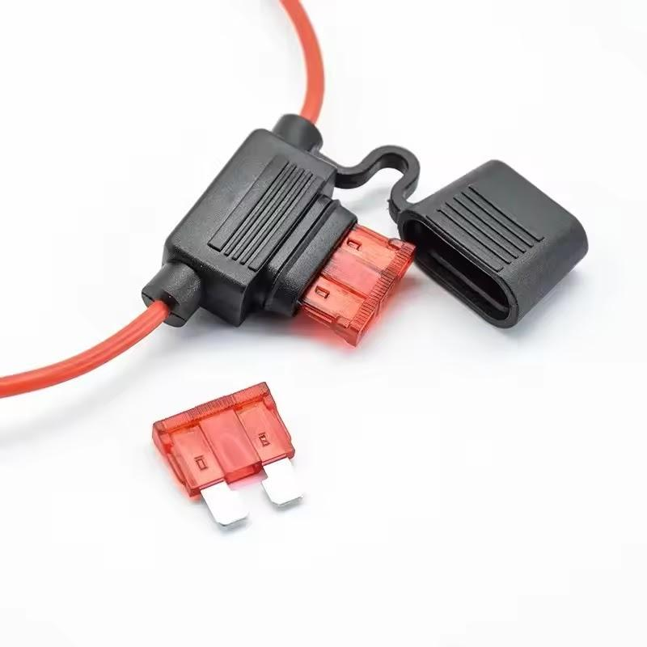</a> |
| WAGO-style lever connectors | Multiple | Owned | 2/3/5-port assortment Use: Power distribution [Product reference](https://www.aliexpress.us/item/3256812477750135.html) Sheet1 row 75 | <a href="inventory-075-wago-style-lever-connectors.jpg">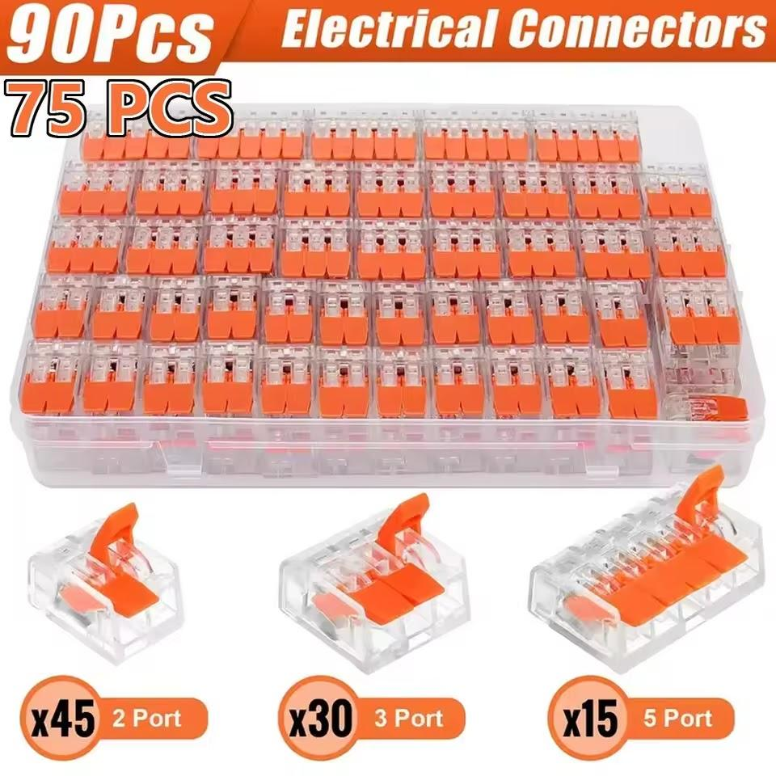</a> |
| 18 AWG red/black stranded wire | Multiple | Owned | Recommended tinned copper silicone wire Use: Main power/ground distribution Arrival confirmed September 17, 2026. Sheet1 row 76 | — |
| 22 AWG hookup/jumper wire | Multiple | Owned | Signal/light-load wiring Use: Sensors/control wiring Sheet1 row 77 | — |
| 22 AWG Wire | Multiple | Owned | Signal/light-load wiring Yellow, Red, Green, Black, Blue Use: Sensors/control wiring [Product reference](https://www.aliexpress.us/item/3256808061834409.html) Sheet1 row 78 | <a href="inventory-078-22-awg-wire.jpg">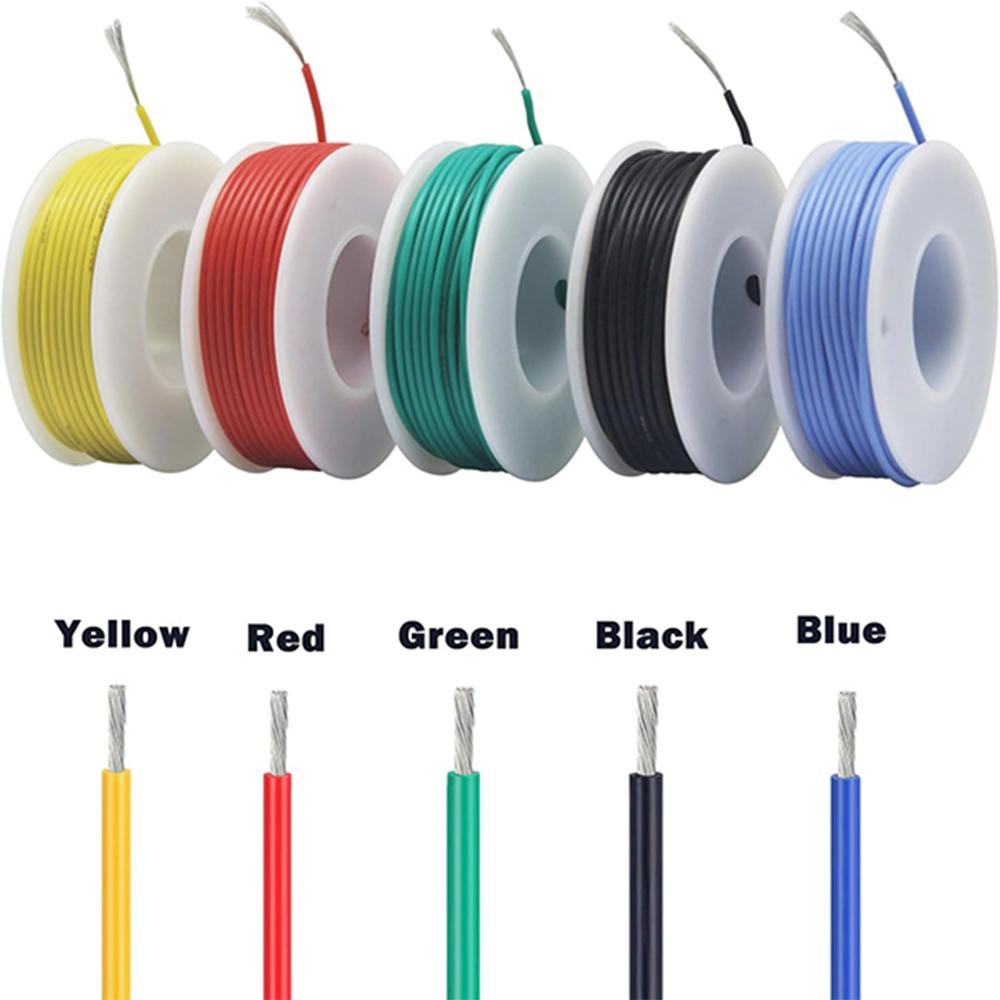</a> |
| TP4056 18650 Battery Charger Module | 2 | Owned | 18650 TP4056 Lithium Battery Charger Module Charging Board With Protection Dual Functions Li-ion USB-C [Product reference](https://www.aliexpress.us/item/3256810077355114.html) Sheet1 row 115 | <a href="inventory-115-tp4056-18650-battery-charger-module.jpg">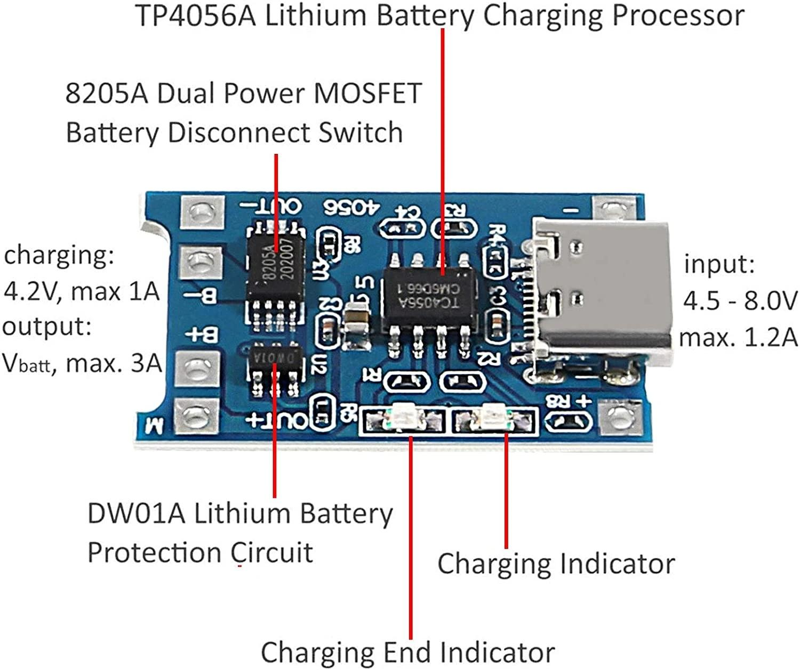</a> |

## Switching / Protection

| Component | Qty | Status | Details and notes | Photo |
| --- | --- | --- | --- | --- |
| MOSFETs | Multiple | Owned | Electronic power switching Use: Pumps, solenoids, loads Sheet1 row 79 | — |
| Relays | Multiple | Owned | Electromechanical switching Use: Loads / isolation Sheet1 row 80 | — |
| Capacitors | Multiple | Owned | Various capacitors Use: Filtering, decoupling, timing Sheet1 row 81 | — |
| Resistors | Multiple | Owned | Various resistor values Use: LED current limiting, pullups, dividers Sheet1 row 82 | — |
| Diode | Multiple | Owned | Fast Switching Schottky Diode kit set 1N4148 1N4007 1N5819 1N5399 1N5408 1N5822 FR107 FR207,8values=100pcs,Electronic Components Use: Loads / isolation [Product reference](https://www.aliexpress.us/item/2251832446756419.html) Sheet1 row 102 | <a href="inventory-102-diode.jpg">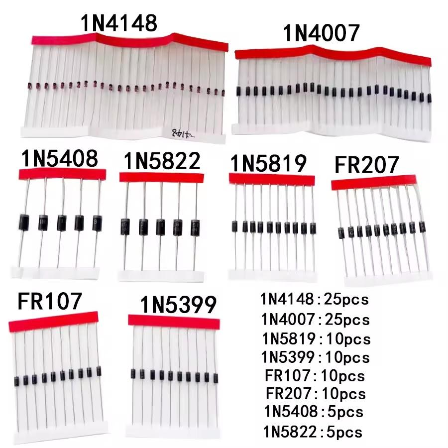</a> |

## Water / Cooling

| Component | Qty | Status | Details and notes | Photo |
| --- | --- | --- | --- | --- |
| Water pumps | Multiple | Owned | Small DC pumps Use: Greenhouse/water systems Sheet1 row 83 | — |
| TEC1-12706 Peltier modules | 2 | Owned | Thermoelectric cooler Use: Mini fridge/cooler Sheet1 row 84 | — |
| Heatsinks | Multiple | Owned | Includes TEC and salvaged heatsinks Use: Cooling power devices Sheet1 row 85 | — |
| Water blocks | Multiple | Owned | Cooling blocks 40x40x12mm, 80x40x12mm Use: TEC cooling project [Product reference](https://www.aliexpress.us/item/3256812371755324.html) Sheet1 row 86 | <a href="inventory-086-water-blocks.jpg">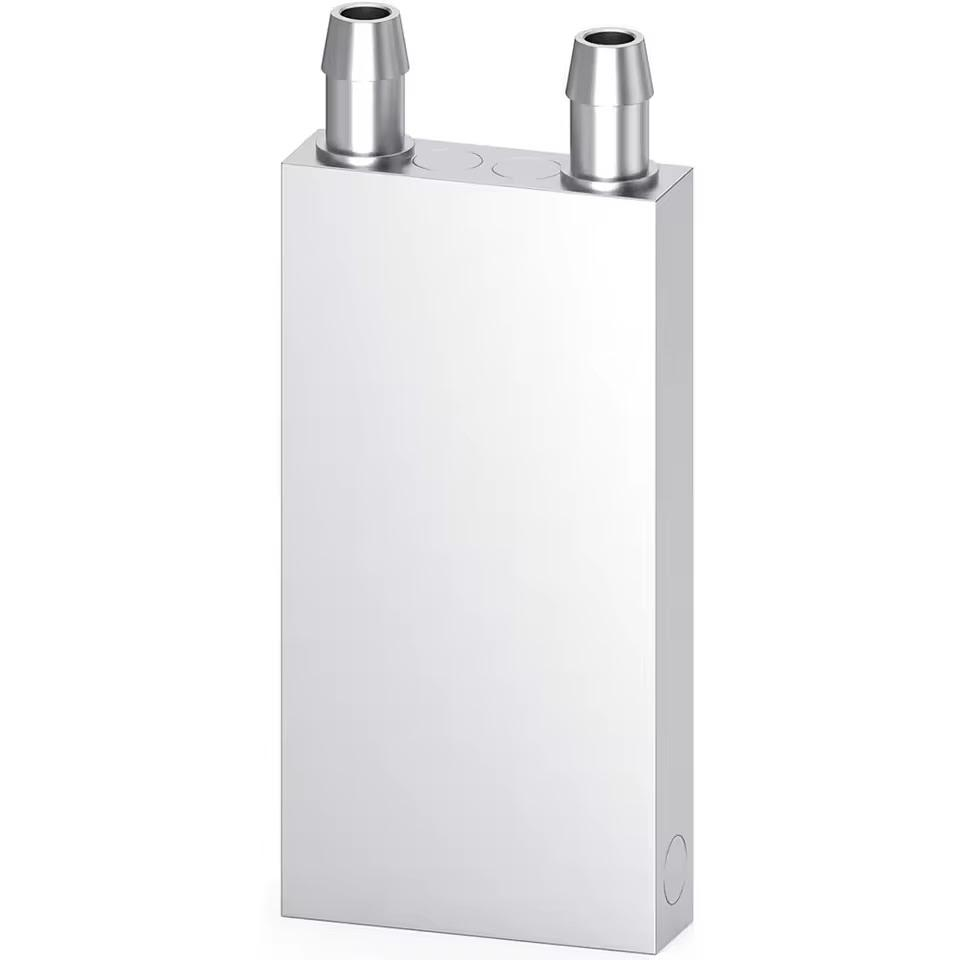</a> |
| W1209 thermostat controllers | 2 | Owned | Temperature control module Use: Mini fridge/cooler Sheet1 row 87 | — |
| Heatsink with fan | 1 | Owned | 80*80*80mm Aluminum Heatsink Radiator Heat Sink DC 12V 45W for TEC1 Thermoelectric Cooler Peltier TEC1 12706 12705 12703 12715 Use: Cooling power devices [Product reference](https://www.aliexpress.us/item/3256805634815464.html) Sheet1 row 106 | <a href="inventory-106-heatsink-with-fan.jpg">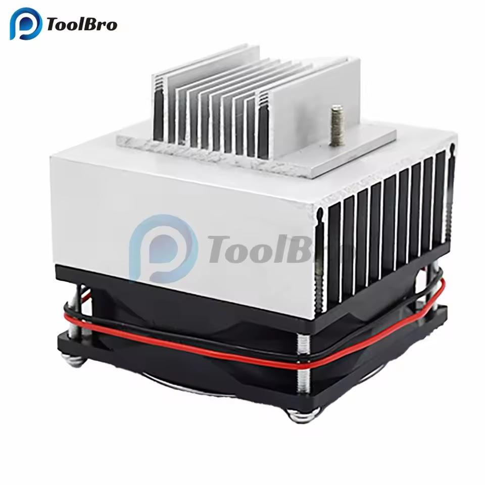</a> |
| W1209 Temperature Control Switch | 1 | Owned | Javino W1209 DC 12V Heat Cool Thermostat Temperature Control Switch Thermometer Controller for Refrigerator/Heater 12V Blue Use: Sensors/control wiring [Product reference](https://www.aliexpress.us/item/3256810450758471.html) Sheet1 row 109 | <a href="inventory-109-w1209-temperature-control-switch.jpg">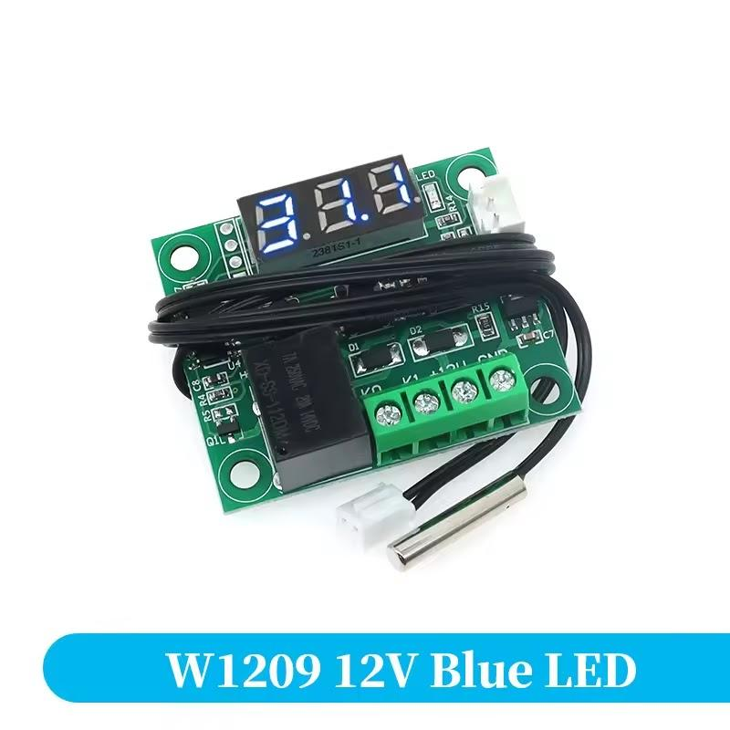</a> |

## Connectors / Prototyping

| Component | Qty | Status | Details and notes | Photo |
| --- | --- | --- | --- | --- |
| Jumper cables | Multiple | Owned | Dupont-style jumper wires Use: Breadboard/prototyping Sheet1 row 88 | — |
| 2.54mm female header kit | Multiple | Owned | 4/6/8/10/12/16/40-pin single-row sockets Use: Module connections Sheet1 row 89 | — |
| USB-C cables/connectors | Multiple | Owned | USB-C items shown with controllers Use: Power/programming [Product reference](https://www.aliexpress.us/item/3256806984951525.html) Sheet1 row 90 | — |
| Heat shrink tube | Multiple | Owned | thermoresistant tube Use: Permanent wiring 127-750pcs Heat-shrink Tubing Thermoresistant Tube Heat Shrink Wrapping Kit Electrical Connection Wire Cable Insulation Sleeving Sheet1 row 97 | — |
| M2, M2.5, M3, M4, M5 screws | Multiple | Owned | 320pcs Premium Stainless Steel Screw and Nut Assortment Kit - Corrosion-Resistant, Snap-in Nuts, M2 to M5 Sizes See photo for sizes Use: Prototyping [Product reference](https://www.aliexpress.us/item/3256807676645012.html) Sheet1 row 107 | <a href="inventory-107-m2-m2-5-m3-m4-m5-screws.jpg">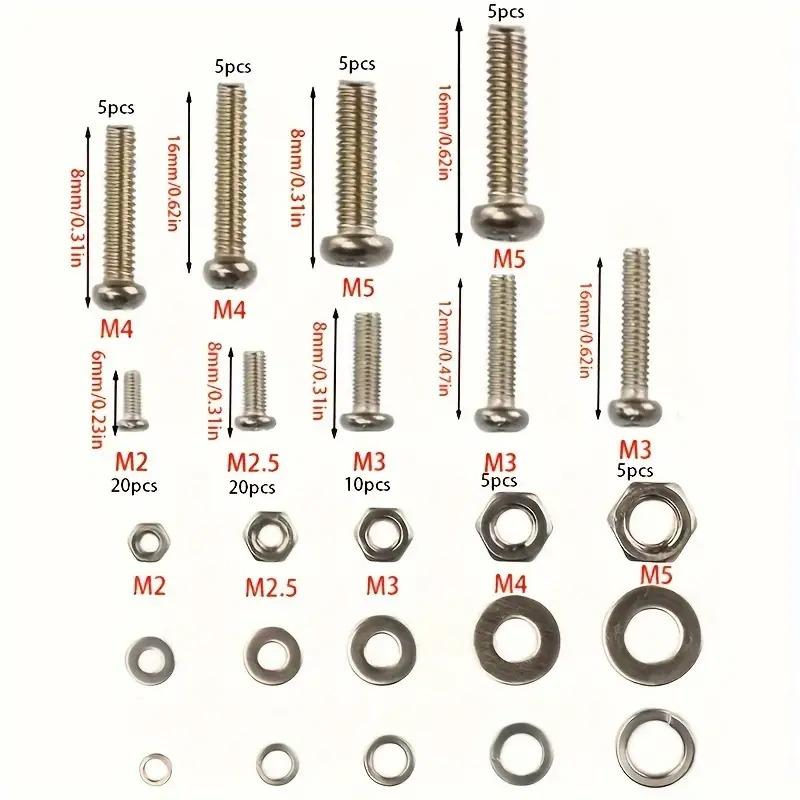</a> |
| M1.2, M1.4, M1.6, M2, M3 | Multiple | Owned | 750pcs M1.2 M1.4 M1.6 M2 M3 Mini Micro Phillips Thin Wafer Flat Head Screw Bolt for Laptop Phone Glasses Set Assortment Kit See photo for sizes Use: Prototyping [Product reference](https://www.aliexpress.us/item/3256802317314157.html) Sheet1 row 108 | <a href="inventory-108-m1-2-m1-4-m1-6-m2-m3.jpg">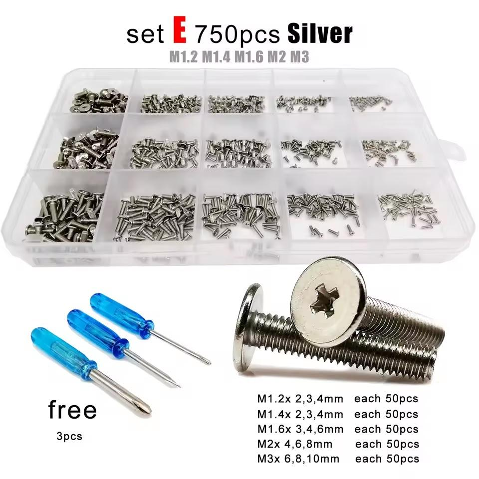</a> |

## Tools

| Component | Qty | Status | Details and notes | Photo |
| --- | --- | --- | --- | --- |
| Soldering iron | 1 | Owned | Electronics soldering tool Use: Permanent wiring Sheet1 row 91 | — |

## Salvage

| Component | Qty | Status | Details and notes | Photo |
| --- | --- | --- | --- | --- |
| BBB863 main control PCB | 1 | Salvaged | Original controller with tactile switches K2/K3 Epoxy-covered controller Use: Reverse-engineering / parts salvage Sheet1 row 92 | — |
| BBB863 spring/contact assemblies | 2 | Salvaged | Mechanical/electrical contacts Use: Future experiments Sheet1 row 93 | — |
| BBB863 flexible contact strip | 1 | Salvaged | Small brown flexible PCB/contact strip Use: Future identification Sheet1 row 94 | — |
| HD_DCV1.2 mini DC input board | 1 | Salvaged | Mini barrel jack, ON/OFF slide switch, LED+/LED- output Voltage and jack size TBD Use: Switched low-voltage input Sheet1 row 95 | — |
| White socket-like component | 1 | Salvaged | Appears more like a small lamp/light-bulb socket than motor component Use: Future identification Sheet1 row 96 | — |

## Expansion

| Component | Qty | Status | Details and notes | Photo |
| --- | --- | --- | --- | --- |
| 74HC595 Output Port Expansion 8 Shift | 1 | Owned | DC3.3-5V 74HC595 expansion module shift register 8-bit shift register [Product reference](https://www.aliexpress.us/item/3256804466747471.html) Sheet1 row 112 | <a href="inventory-112-74hc595-output-port-expansion-8-shift.jpg">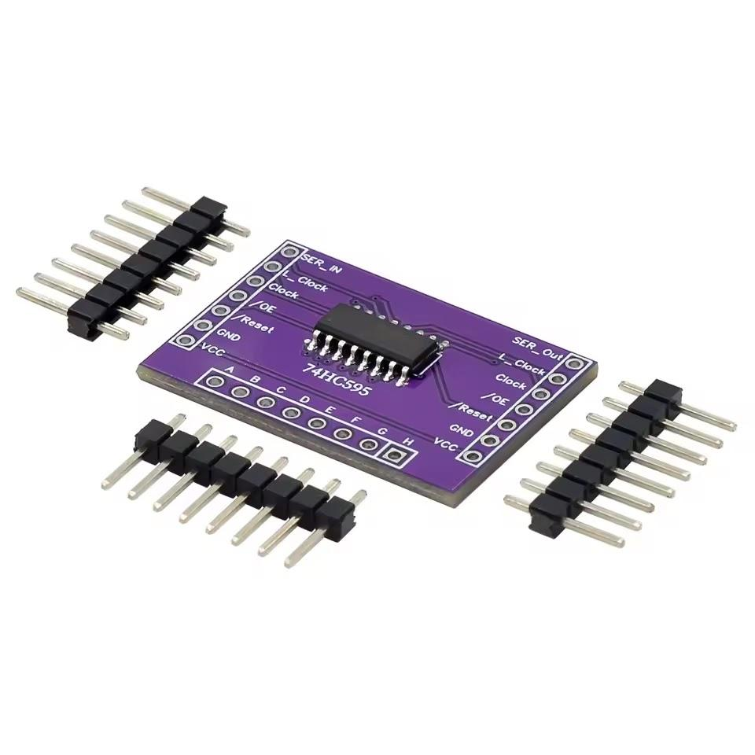</a> |
| 74HC595 Output Port Expansion 3 to 24pin LED control | 1 | Owned | Microcontroller Serial to Parallel Pin IO Expansion Module 74HC595 Output Port Expansion 3 to 24pin LED control [Product reference](https://www.aliexpress.us/item/3256807085990530.html) Sheet1 row 113 | <a href="inventory-113-74hc595-output-port-expansion-3-to-24pin-led-control.png">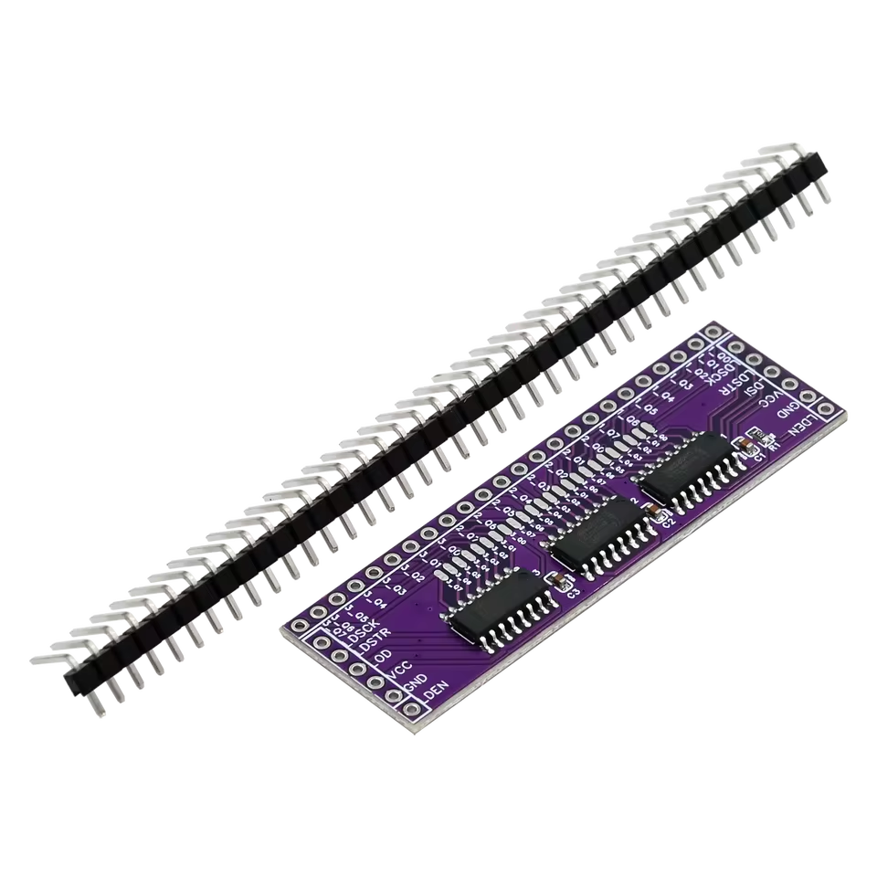</a> |

